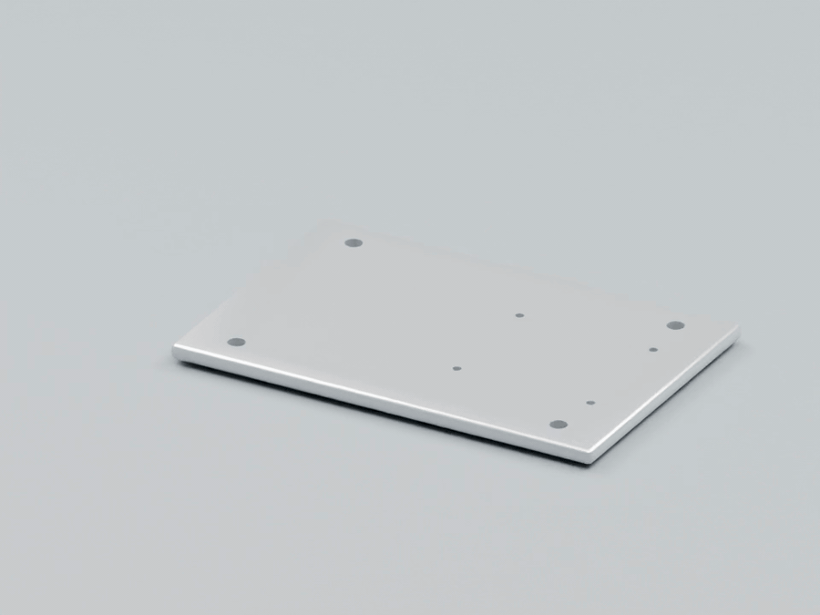
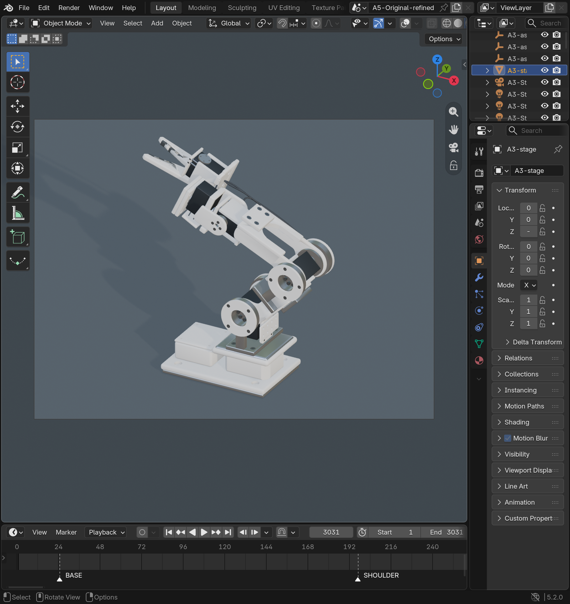
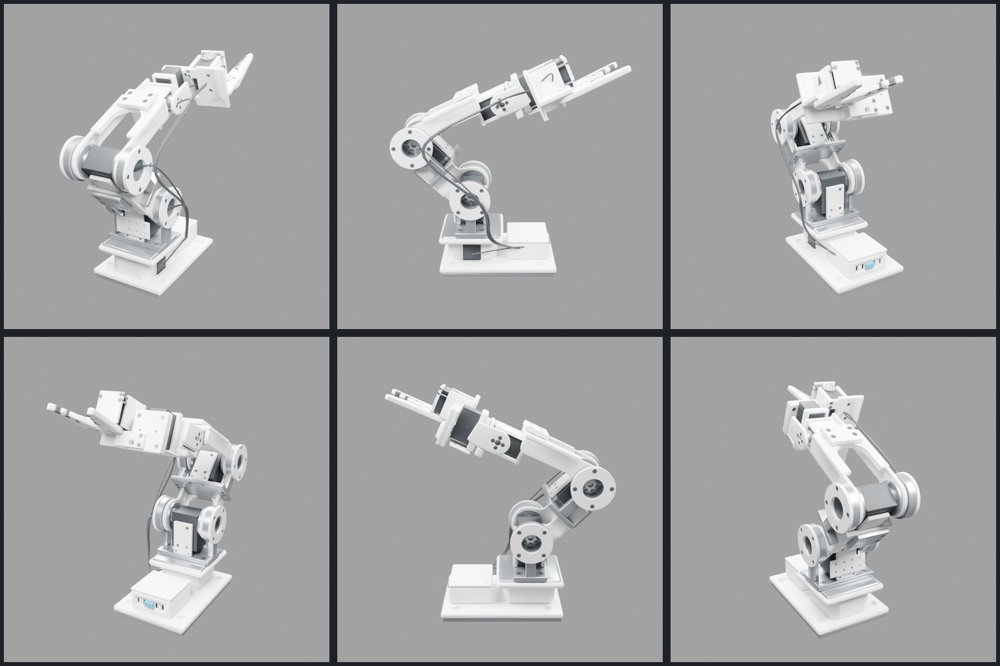
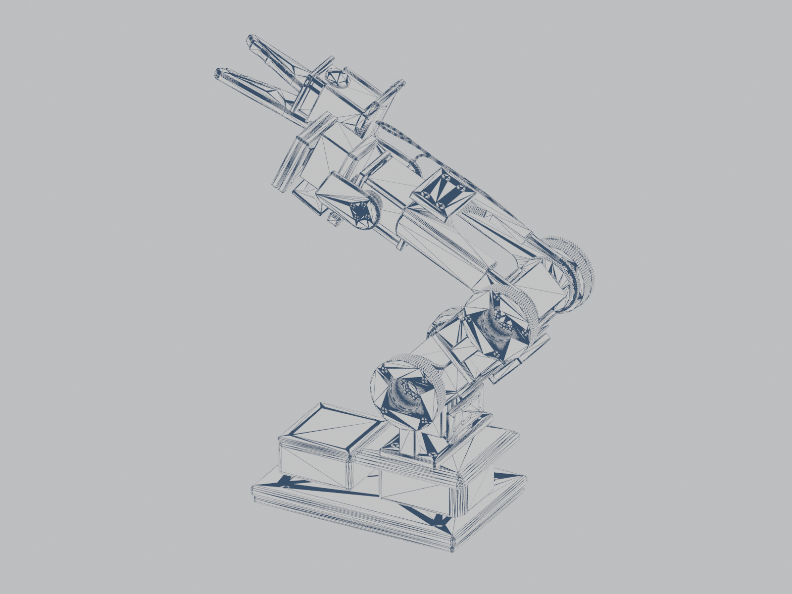
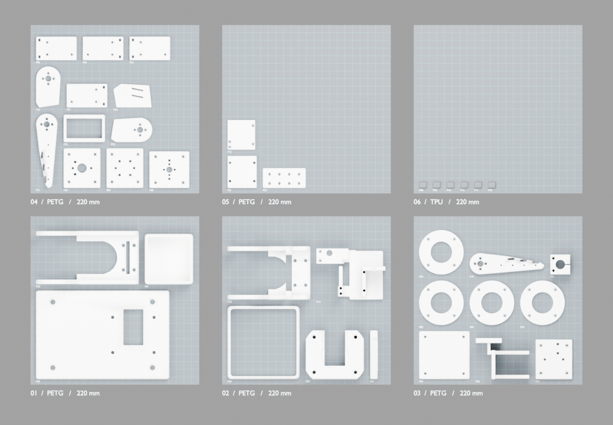
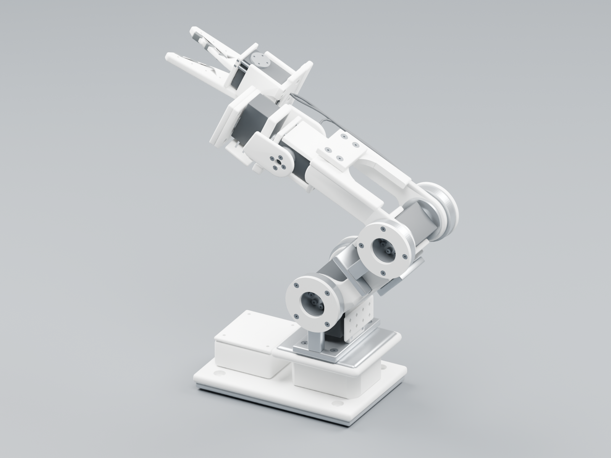
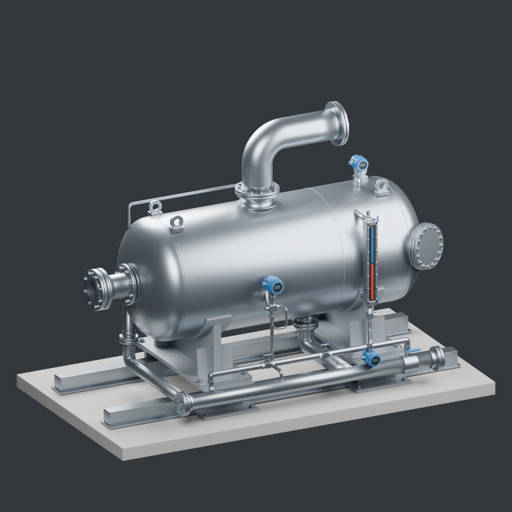
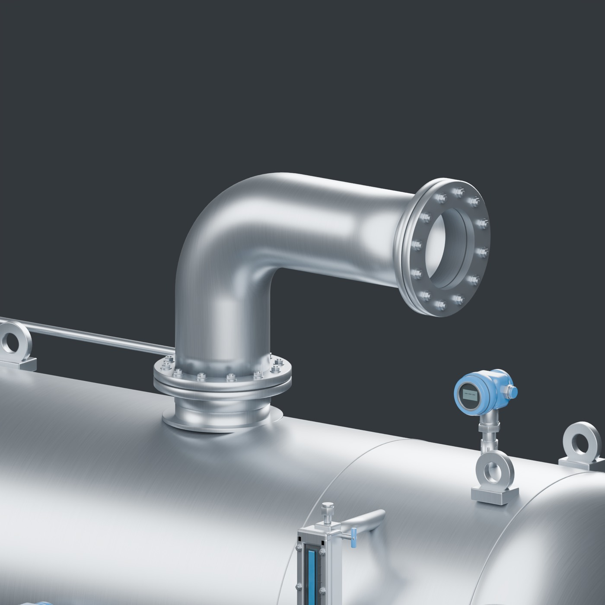
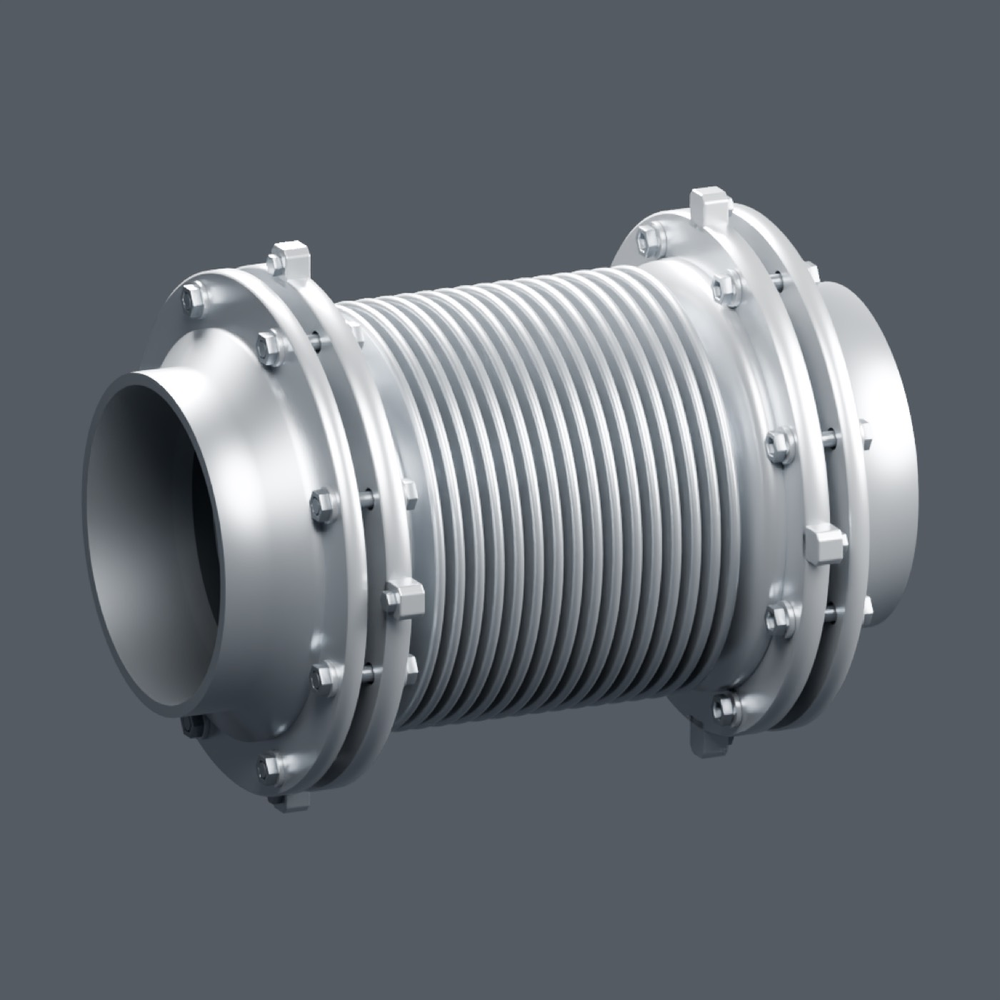

# design-os-3d-blender

<p align="center">
  
</p>

<p align="center">
  <a href="LICENSE"></a>
  
  
  
  
  <a href="https://github.com/jangtrinh/design-os-3d-blender/releases"></a>
  
  
  
  
  
</p>

<p align="center"><b>Spec → build → verify → gate.</b> An agent operating system for Blender that ships parts you can print, not pictures you can post.</p>

**Contents:** [What is inside](#-what-is-inside) · [Proof](#-proof-the-robot-arm-is-real-geometry-not-a-picture) · [ORC workflow demo](#-orc-workflow-demo) · [Quick start](#-quick-start) · [The loop](#-the-loop-agents-follow) · [Robot-arm demo](#-robot-arm-demo-builds) · [Notes](#-notes) · [License](#-license)


An AI-agent operating system for **Blender 5.2 LTS**: skills, a verified knowledge base, an execution contract, and a production gate — built so an agent (Claude Code, Codex, Google Antigravity, or any MCP client) can model, rig, animate, render, and ship **3D-printable, dimension-correct parts** rather than pretty demos.

Everything here is Blender-native: no vendor mesh generation, no downloaded assets, no paid model calls.

## 🧭 What is inside

| Layer | Path | Purpose |
|---|---|---|
| Operating rules | `AGENTS.md` (canonical, Codex) · `CLAUDE.md` (imports it) · `.project-agent.md` (binding rules) | Contract-first loop, sentinel execution contract, verify ladder, failure map from real sessions |
| Skills | `.agents/skills/blender-agent-core`, `blender-image-to-3d`, `blender-knowledge-workbench` (`.claude/skills` mirrors) | Router + recipes; reference-image reconstruction; catalog-driven reading packs |
| Knowledge base | `knowledge/` (28 domain files, 5.2-verified) + `research/` (engineering syntheses) | Data-API-first bpy patterns, decision tables, failure→fix tables, standards for CAD/print/robotics |
| Execution | `scripts/agent_runtime.py`, `scripts/headless-run.sh`, `scripts/blender-socket-client.py` | Every payload ends with `AGENT_OK {json}` / `AGENT_FAIL {json}` (full traceback), exit `0/1/2/3` — Blender's own exit code is unreliable both ways |
| Verification | `scripts/agent-verify-lib.py` (+ `scripts/agent_verify/`) | Numeric "sense organs": framing, frame stats, state-restoring previews, isolated export re-import |
| Production gate | `specs/build-spec.schema.json`, `scripts/production-gate.py` (+ `scripts/production_gate/`) | Spec → manifold/self-intersection/volume, dimensions ± tolerance, wall/overhang screens, hole diameters vs ISO 273 / ISO 4762 / heat-set tables, STL round-trip + sha256 manifest; report bound to scene+spec hashes |
| Boilerplates | `scripts/boilerplates/` (30 modules) | CAD, gears, fasteners, O-rings, connectors, rigs, geometry nodes, render — each self-tests under the sentinel contract |
| Tests | `tests/execution`, `tests/production-gate`, `tests/knowledge` | Execution-contract, production-gate, and knowledge-catalog suites |
| MakerWorld leg | `makerworld-pipeline/` (validator `scripts/validate_bambu_3mf.py`, fixture generator `tools/`, docs) | Validates a Bambu Studio project 3MF (geometry through the production extension, per-plate bbox, bed fit, thumbnails, settings); sourced publishing constraints and a human publish checklist — printing and publishing stay manual by MakerWorld policy |
| Agent runtimes | `AGENTS.md` (Codex, any AGENTS.md reader) · `CLAUDE.md` (Claude Code) · `.agents/rules`, `.agents/workflows`, `.agents/mcp_config.json` (Google Antigravity) | Same skills folder (`.agents/skills`) is read natively by Antigravity; setup in `docs/antigravity-setup.md` |
| Worked examples | `builds/robot-arm-*`, `builds/watch-winder-capsule` | Two builds: the robot-arm session (accepted assembly film + 38-part print kit) and the watch-winder capsule (native render asset + gate-passed print plates) — each with its honest limits |

## 🔬 Proof: the robot arm is real geometry, not a picture

| | |
|---|---|
|  |  |
| The model open in Blender 5.2.0 — scene `A5-Original-refined`, 671 objects, frame 3031/3031, outliner and properties visible (full-window screenshot, not a viewport crop) | Six-angle Cycles orbit of the assembled parts at the final frame, rendered headless from the shipped `.blend` |
|  |  |
| Render tessellation of the 402 arm part meshes (114,723 polygons), Cycles Wireframe node — every edge you see is in the file | 38 fit-prototype parts arranged on five 220×220 mm plates (PETG + TPU), exported as STL/3MF |



*Cycles render of the assembled model at the final frame (1600×1200, 96 samples, Metal). The full-speed MP4 of the assembly film is in `builds/robot-arm-original-refined/video/`.*

**Production gate run on the real print kit (2026-09-06).** The 38 exported STLs were re-imported into a metre-scaled scene and gated against a spec generated from `parts-list.csv` (target dimensions ± 0.1 mm, one shell per part, PETG/TPU):

```
GATE PASS | 38 part(s), 0 failing check(s) | scene=72ab501e47bf spec=d88bc836fb3a | Blender 5.2.0 LTS
836 checks pass · 0 fail · 38 skip (no min_wall_mm declared) · 38 info (overhang reported, not gated)
```

Per part: `non_manifold_edges`, `non_contiguous_edges`, `wire_edges`, `loose_verts`, `zero_area_faces`, `self_intersection_pairs`, `shells`, `signed_volume_positive`, `bbox_dims_mm`, `scale_applied`, `scene_unit_system`, `scene_scale_length`, then STL round-trip repeats of the topology and dimension checks. Report, spec and the reproduction script: `builds/robot-arm-print-assembly/reports/gate-report-260906.json`, `gate-spec-260906.json`, `scripts/gate-import-parts.py`. The report's `exclusions` say what this does **not** prove: load capacity, print success, assembly fit, thermal/creep — those remain physical evidence, and the arm stays unreleased for manufacture.

## 🏭 ORC workflow demo

The [ORC component workflow](docs/orc-component-workflow.md), [brief template](docs/orc-component-brief-template.md), and [Separator worked example](docs/orc-separator-worked-example.md) show how a reference-driven component moves from coverage and interface contracts to object-level evidence and bounded review.

| | |
|---|---|
|  |  |
| Completed render-only Separator component: overview. | Completed render-only Separator component: a critical crop used to inspect the vapor nozzle, flange, and attached instrument. |

<p align="center">
  
</p>

*Form-approved reusable bellows-family pilot. Exchanger-train detail, a full plant, print readiness, and manufacturing qualification remain out of scope.*

The three images are compressed derivatives of native Blender renders, not source references. [Provenance](docs/media/orc-demo-provenance.json) records the source and output hashes plus the evidence scope.

## 🚀 Quick start

Requirements: macOS/Linux, Blender 5.2.x, Python 3.10+ on the host (stdlib only). Optional interactive path: [blender-mcp](https://github.com/ahujasid/blender-mcp) addon connected in the Blender GUI.

```bash
export BLENDER_BIN=/Applications/Blender.app/Contents/MacOS/Blender   # adjust
python3 -m unittest discover -s tests/execution                      # execution contract
python3 -m unittest discover -s tests/production-gate                # gate on generated fixtures
python3 scripts/blender-knowledge.py check && python3 scripts/blender-knowledge.py list
```

Run any bpy payload headless and get a machine-readable verdict:

```bash
bash scripts/headless-run.sh my-pass.py          # last line: AGENT_OK {...} or AGENT_FAIL {...}; exit 0/1/2/3
```

Over MCP (Claude/Codex with the blender-mcp addon), execute the same payload with the same contract:

```python
import sys; sys.path.insert(0, "<ROOT>/scripts")
import agent_runtime as rt; rt.run_file("<ROOT>/builds/<slug>/pass-01.py")
```

Gate a part for printing (write the spec **before** detailing):

```bash
cp specs/examples/bracket-m3.spec.json builds/my-part/spec.json   # dims ± tol, holes, fasteners, material, min wall
python3 scripts/production-gate.py --scene builds/my-part/part.blend --spec builds/my-part/spec.json \
        --report builds/my-part/reports/gate-report.json --export-dir builds/my-part/parts
```

Exit `0` = every declared check passed (digital evidence only); `1` = a requirement failed; `2` = spec/scene incomplete; `3` = execution error. `specs/README.md` lists exactly what each check proves and does **not** prove (load, fit after shrinkage, thermal duty stay physical evidence).

## 🔁 The loop agents follow

```
Contract → Plan (scene graph) → Code (pass files ≤ ~80 lines) → Critic → Execute → Verify → Verdict
```

- **Contract first.** A printable part needs `spec.json`; a reference image needs a fidelity contract. Missing numbers → `request-input`, not a guess. (Every full rebuild in our record traced to a spec that arrived after detailing.)
- **Numbers before pixels.** Assert postconditions, then `framing()` + a 0.2 s preview, then a screenshot with the expectation written down first.
- **Verdict is one of** `continue · refine-spec · refine-code · request-input · stop`. Two failures on the same step change the *class* of approach; three escalate.
- **Success is the sentinel**, never "Code executed successfully".

## 🤖 Worked examples (`builds/`)

Two builds ship here, and nothing else under `builds/`.

**Robot arm (final), in two folders:**

- `robot-arm-original-refined/` — the accepted step-by-step assembly film (3,020 frames, Cycles), source `.blend`, clearance/overlap checks, decoded-frame review reports.
- `robot-arm-print-assembly/` — 38 fit-prototype parts on 5 plates (PETG + TPU) as STL/3MF, parts list, assembly-step CSV, mesh audit and export checks.

**Watch-winder capsule:**

- `watch-winder-capsule/` — a single-slot winder built from native geometry only: pass scripts (blockout → booleans → detail → materials → studio → film keys → print prep), `design-parameters.json`, `spec.json`, the small `.blend` files, numeric reports, the 17 gate-passed parts and the 6 print plates as STL, plus three contact sheets as proof of output.

Status is deliberately separated per domain. Arm: **media accepted · motion checked at sampled poses · fit prototypes exported · manufacture BLOCKED** (wrist torque margin, retention hardware, thermal duty and loaded trials remain open). Winder: **stills delivered · motion PASS at sampled poses · digital gate PASS · fit visualization only · physical manufacture BLOCKED — nothing printed**. Both build READMEs carry the full evidence tables. The frame sequences, films and draft renders (several GB) are not shipped.

## 📝 Notes

- `<ROOT>` in docs and snippets = absolute path of this repo on your machine.
- `.agents/skills/img2threejs` is a vendored copy of [img2threejs](https://github.com/img2threejs/img2threejs) (Apache-2.0, license included).
- `tests/blender/` target drone builds that are not shipped here.

## 📄 License

MIT — see `LICENSE`.
