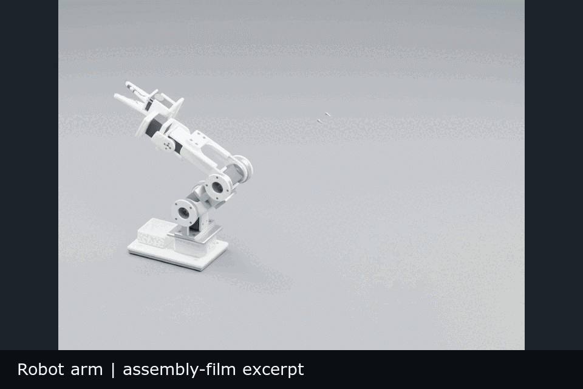
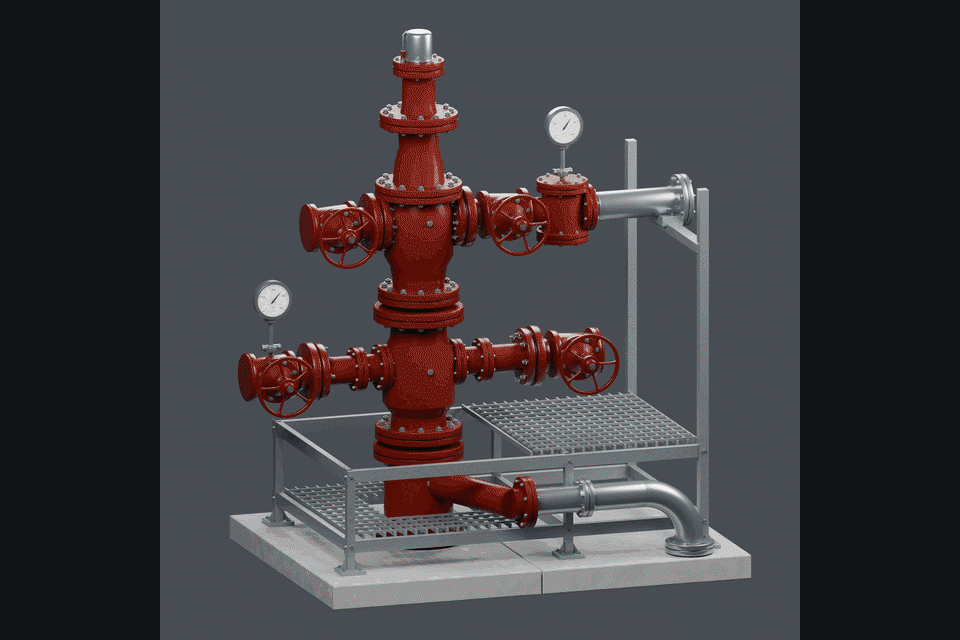

# design-os-3d-blender



Blender-native modeling, reusable components and evidence-based delivery. This repository contains agent skills, engineering reading packs, execution tools, verification gates and worked builds for Blender 5.2 LTS.

[Live site](https://jangtrinh.github.io/design-os-3d-blender/) · [Image galleries](#image-galleries) · [Reconstruction workflow](docs/orc-component-workflow.md) · [Session lessons](docs/orc-session-lessons.md) · [Quick start](#quick-start) · [Tools and skills](#tools-and-skills)

The opening GIF shows complete-component overviews of the robot arm, watch winder and five ORC components. Images contain no added captions or banners. Names, development status and evidence limits live in the surrounding documentation. [Media provenance](docs/media/gallery/manifest.json).

## Image galleries

Each gallery separates overall views from the component's available detail views. ORC images are derivatives of native renders; their source models are not included in this public checkout. Robot-arm, watch-winder and CK-001 keyboard worked builds are included under `builds/`.

### Geothermal ORC components



| Component | Gallery | Evidence scope |
|---|---|---|
| C01 · Wellhead | [Overall and valve details](docs/galleries/wellhead.md) | Render review imagery; physical qualification is separate. |
| C02 · Separator | [Vessel, nozzles and instrumentation](docs/galleries/separator.md) | Render-only detail set, including the repaired vapor interface. |
| C03 · Exchanger train | [Overview, bellows, instruments and hardware](docs/galleries/exchanger-train.md) | Current R7 HQ imagery; source-derived details retain their stated technical limits. |
| C04 · Three-stage exchanger | [Circuit layout and installed instruments](docs/galleries/three-stage-exchanger.md) | Verification previews; full detail and HQ delivery remain in progress. |
| C05 · Turbine–generator | [Eight HQ overall and close-up views](docs/galleries/turbine-generator.md) | Refreshed cabinet revision; final media integrity and visual review completed. |

The current plant layout uses an illustrative 1:15 scale. Catalogue dimensions and installation manuals support specific modeling decisions; they do not establish a selected vendor package, plant capacity or as-built engineering design. A component gallery is not evidence that the complete site has been integrated or qualified.

### Mechanical products

| Product | Gallery | Included worked build |
|---|---|---|
| Robot arm | [Assembly and completed model](docs/galleries/robot-arm.md) | [Native assembly build](builds/robot-arm-original-refined/README.md) and [38-part fit prototype](builds/robot-arm-print-assembly/README.md). |
| Watch-winder capsule | [Overview and surface details](docs/galleries/watch-winder.md) | [Parameters, native scenes, scripts and print-kit evidence](builds/watch-winder-capsule/README.md). |
| CK-001 reference keyboard | [Revision B review: 3D viewer, Full HD stills and film](https://jangtrinh.github.io/design-os-3d-blender/reviews/ck-001/r02/) · [package files](docs/reviews/ck-001/r02/README.md) | [Contracts, pass scripts, manufacturing studies and tests](builds/reference-keyboard/README.md). Run directories and the delivery archive stay local. |

### Reusable parts

[Instrument families and mounting details](docs/galleries/instruments.md) show the shared parts used across larger assemblies. Reuse requires a defined local origin, mounting interface, supported parameters and verification in the receiving assembly.

## What the component work taught us

1. **Specify the construction.** A wheel, cabinet or gauge name is an inventory item. A build brief needs profile, thickness, transitions, layers, mounting and a visible condition that would reject the result.
2. **Reconcile image and technical evidence.** Use the main view for composition and all close-ups for local form. Read applicable drawings and manuals for flow, ports, instrumentation and dimensions; label unknowns and illustrative choices.
3. **Qualify reusable families.** Prove the first detailed part, then check a real second consumer and its interfaces. Repetition does not qualify a new scale or mounting arrangement.
4. **Verify both the artifact and the verifier.** A clean mesh or a green report does not prove fidelity. Surprising measurements need a checked numerical method before geometry is changed.
5. **Bind delivery to the actual revision.** Freeze source, camera and settings; inspect output-density proofs and final originals; preserve old media when geometry changes. Record manual checks and automated gates separately.

Read the [complete lessons and next-component procedure](docs/orc-session-lessons.md), [public journal](docs/journals/orc-component-reconstruction.md), [brief template](docs/orc-component-brief-template.md), and [Separator worked example](docs/orc-separator-worked-example.md).

### Product workflow learned from CK-001

The [session retrospective](docs/ck-001-session-retrospective.md) follows API research,
the three upstream mechanisms, actual keyboard failures, native Full HD delivery
and C03/E02 engineering checks. Start a new project from the
[product workflow template](docs/product-workflow-template.md). Specialized reading:
[geometry diagnosis](knowledge/60-pipeline/geometry-diagnostic-workflow.md),
[native media delivery](knowledge/60-pipeline/native-render-delivery.md), and
[manufacturing evidence](knowledge/60-pipeline/manufacturing-evidence-workflow.md).

```bash
python3 scripts/blender-knowledge.py route native-hard-surface --topic session-retrospective
python3 scripts/blender-knowledge.py route precision-assembly-metrology --topic geometry-diagnostics
python3 scripts/blender-knowledge.py route render-export-delivery --topic native-render-delivery
python3 scripts/blender-knowledge.py route precision-assembly-metrology --topic manufacturing-evidence
```

The [C03/E02 source package](builds/reference-keyboard/manufacturing/README.md) adds
full-stroke cap clearance, mechanical retention, acrylic collars, corrected LED
polarity and an explicitly incomplete physical pilot ledger. Local C03 scenes,
run reports and archives are not shipped; the public Revision-B gallery remains
historical media for B, not a visualization or approval of C03.

The [HQ coverage gate](docs/hq-coverage-gate.md) validates receipts on its explicit guarded launch route. It does not judge visual likeness or intercept every Blender render. The C05 refresh used a direct renderer after review and approval; its final checks passed, but automated pre-HQ launch protection did not run.

## Tools and skills

| Layer | Entry point | Responsibility |
|---|---|---|
| Operating rules | [AGENTS.md](AGENTS.md), [.project-agent.md](.project-agent.md) | Purpose, contract, execution loop and evidence boundaries. |
| Core Blender skill | [.agents/skills/blender-agent-core](.agents/skills/blender-agent-core/SKILL.md) | Native scene execution, numerical checks and delivery recipes. |
| Image reconstruction skill | [.agents/skills/blender-image-to-3d](.agents/skills/blender-image-to-3d/SKILL.md) | Reference contracts, staged modeling and construction-aware visual review. |
| Knowledge workbench | [.agents/skills/blender-knowledge-workbench](.agents/skills/blender-knowledge-workbench/SKILL.md) | Bounded reading packs and reviewed source routing. |
| Execution contract | `scripts/agent_runtime.py`, `scripts/headless-run.sh` | Structured `AGENT_OK` / `AGENT_FAIL` results and reliable process exit handling. |
| Native pass pipeline | `scripts/native-pipeline.py` | Declared step dependencies, durable attempt journals and hash-checked resumption; execution status stays separate from acceptance. |
| Target-bound criticism | `scripts/native-review.py` | Revision-bound target/candidate/proof packets and complete attributed feature findings; actual visual review remains required. |
| Parameter and source contracts | `scripts/boilerplates/bp_parametric_contract.py` | Explicit mm/m length parameters, local frame/datum/port declarations and source/export byte receipts. |
| Verification | `scripts/agent-verify-lib.py`, `scripts/production-gate.py` | Scene checks, isolated previews, spec-bound digital geometry/export evidence. |
| HQ coverage | `scripts/hq-coverage-gate.py` | Source-bound proof receipts before an explicitly guarded render launch. |
| MakerWorld | [Publishing leg](makerworld-pipeline/README.md) | Bambu project validation and documented publishing constraints. |

The `.claude/skills` directories mirror the local skill sources. Antigravity setup is documented in [the setup guide](docs/antigravity-setup.md). Vendored [img2threejs](.agents/skills/img2threejs/README.md) retains its Apache-2.0 license; production reconstruction uses native Blender geometry.

[Native agent iteration](docs/upstream-agent-integration.md) documents the reviewed
Meshy, Dream-loop and Text-to-CAD mechanisms, their local implementations and a
controlled Blender coupon that distinguishes correct dimensions from missing visual
detail. The upstream hosted-generation, B-rep and device stacks are not installed.

## Quick start

Requirements: Blender 5.2.x, Python 3.10+ and macOS or Linux. Set the Blender binary for your machine. The core host-side tests use the Python standard library.

```bash
export BLENDER_BIN=/Applications/Blender.app/Contents/MacOS/Blender
python3 scripts/blender-knowledge.py check
python3 scripts/blender-knowledge.py list
python3 -m unittest discover -s tests/execution
python3 -m unittest discover -s tests/production-gate
python3 -m unittest discover -s tests/hq-coverage
python3 -m unittest discover -s tests/native-pipeline
python3 -m unittest discover -s tests/native-review
python3 -m unittest tests/boilerplates/test_parametric_contract.py
```

The animation, geometry-nodes and evaluated-mesh contract tests import `bpy`, so they run inside Blender and end with `AGENT_OK`:

```bash
for t in animation geonodes evaluated_mesh; do
  bash scripts/headless-run.sh "tests/boilerplates/test_${t}_contract.py"
done
```

Execute a Blender pass in an isolated process:

```bash
bash scripts/headless-run.sh my-pass.py
```

`<ROOT>` means the absolute path of this checkout. For an interactive session, connect the [blender-mcp](https://github.com/ahujasid/blender-mcp) addon. Then run the same pass through the runtime:

```python
import sys
sys.path.insert(0, "<ROOT>/scripts")
import agent_runtime as rt
rt.run_file("<ROOT>/builds/<slug>/pass-01.py")
```

For a printable part, write the spec before detailing:

```bash
mkdir -p builds/my-part
cp specs/examples/bracket-m3.spec.json builds/my-part/spec.json
python3 scripts/production-gate.py \
  --scene builds/my-part/part.blend \
  --spec builds/my-part/spec.json \
  --report builds/my-part/gate-report.json
```

See [specification and gate behavior](specs/README.md). A digital gate does not establish physical fit, load capacity, pressure, thermal performance or successful printing.

## Evidence boundaries

| Build | Demonstrated | Still separate |
|---|---|---|
| Robot arm | Native assembly film, sampled motion checks, exported fit prototypes and a 38-part digital gate report. | Loaded operation, hardware retention, thermal duty and physical assembly qualification. |
| Watch winder | Native stills, sampled motion checks, digital print-kit checks and fit visualization. | Actual printing, physical fit and manufacturing qualification. |
| CK-001 keyboard | Reference-bound 58-key digital prototype: modeled receivers, guides and D couplings, sampled key travel, form/final gates on eight part families, GLB round-trip of 781 meshes, native Full HD media. | Switch retention, tolerance extremes, electronics and firmware, process trials and bench/load/thermal qualification. |
| ORC components | Reference-driven component development, reusable parts and revision-specific image/geometry checks. | Selected equipment, complete plant integration, process duty and fabrication qualification. |

The worked-build READMEs contain detailed receipts and exclusions. The knowledge catalogue also includes small execution examples; the full private ORC development history and source reference images are not shipped.

## License

[MIT](LICENSE). Vendored dependencies retain their own licenses.
