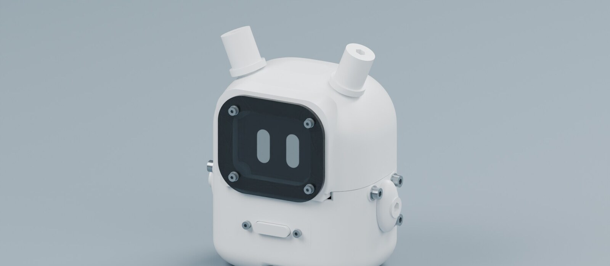
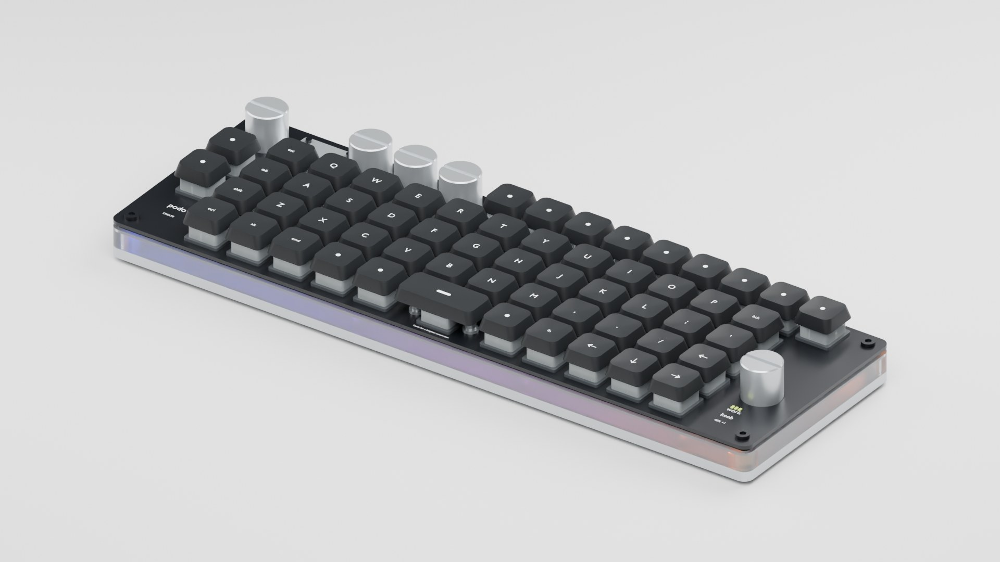

# design-os-3d-blender

*design:os · 3D Blender · agent operating system*

**An AI agent that builds parts natively in Blender, and shows its evidence.**

Agent skills, a verified bpy knowledge base, an `AGENT_OK` / `AGENT_FAIL` execution contract and a production gate for Blender 5.2 LTS. Every worked build below ships with what was checked and what was not.

[](LICENSE)
[](https://github.com/jangtrinh/design-os-3d-blender/commits/main)


[](https://github.com/ahujasid/blender-mcp)


[Live site](https://jangtrinh.github.io/design-os-3d-blender/) · [Worked builds](#worked-builds) · [Install and use](#install-and-use) · [Tools and skills](#tools-and-skills) · [design:os ecosystem](#the-designos-ecosystem) · [Evidence boundaries](#evidence-boundaries)

## Native renders from the worked builds

| | | |
|---|---|---|
|  |  |  |
| DC-01 desktop companion | CK-001 reference keyboard | Robot arm |

Rendered in Blender, no added captions or banners. Names, development status and evidence limits live next to each build. [Media provenance](docs/media/gallery/manifest.json) · [the full set on the live site](https://jangtrinh.github.io/design-os-3d-blender/).

## Worked builds

Two builds ship a public review page with the delivered package beside it.

| Build | Review page | What the repository carries |
|---|---|---|
| **DC-01 desktop companion** — printable parts, a real carrier board and a 39-second assembly film | [Revision R03](https://jangtrinh.github.io/design-os-3d-blender/reviews/dc-01/r03/) · [package files](docs/reviews/dc-01/r03/README.md) | 18 printable parts through the geometry gate, a KiCad carrier with zero ERC and DRC violations, and a 39-second native animatic. Eighteen gated STL files, two plates, the CAD sources and the film travel with the page; run directories and editable scenes stay local. Manufacture not approved. |
| **CK-001 reference keyboard**, built native from one photo | [Revision B](https://jangtrinh.github.io/design-os-3d-blender/reviews/ck-001/r02/) · [package files](docs/reviews/ck-001/r02/README.md) | 58 keys and 5 knobs rebuilt from one photo; 781 meshes in a GLB that reopens within 0.05 mm, reviewable in the browser. [Contracts, pass scripts, manufacturing studies and tests](builds/reference-keyboard/README.md). |

### Mechanical products

| Product | Gallery | Included worked build |
|---|---|---|
| Robot arm | [Assembly and completed model](docs/galleries/robot-arm.md) | [Native assembly build](builds/robot-arm-original-refined/README.md) and [38-part fit prototype](builds/robot-arm-print-assembly/README.md) |
| Watch-winder capsule | [Overview and surface details](docs/galleries/watch-winder.md) | [Parameters, native scenes, scripts and print-kit evidence](builds/watch-winder-capsule/README.md) |

### Geothermal ORC components

ORC images are derivatives of native renders; their source models are not in this public checkout.

| Component | Gallery | Evidence scope |
|---|---|---|
| C01 · Wellhead | [Overall and valve details](docs/galleries/wellhead.md) | Render review imagery; physical qualification is separate. |
| C02 · Separator | [Vessel, nozzles and instrumentation](docs/galleries/separator.md) | Render-only detail set, including the repaired vapor interface. |
| C03 · Exchanger train | [Overview, bellows, instruments and hardware](docs/galleries/exchanger-train.md) | Current R7 HQ imagery; source-derived details retain their stated technical limits. |
| C04 · Three-stage exchanger | [Circuit layout and installed instruments](docs/galleries/three-stage-exchanger.md) | Verification previews; full detail and HQ delivery remain in progress. |
| C05 · Turbine–generator | [Eight HQ overall and close-up views](docs/galleries/turbine-generator.md) | Refreshed cabinet revision; final media integrity and visual review completed. |

The plant layout uses an illustrative 1:15 scale. Catalogue dimensions and installation manuals support specific modeling decisions; they do not establish a selected vendor package, plant capacity or as-built engineering design. A component gallery is not evidence that the complete site has been integrated or qualified.

### Reusable parts

[Instrument families and mounting details](docs/galleries/instruments.md) show the parts shared across assemblies. Reuse requires a defined local origin, a mounting interface, supported parameters and verification in the receiving assembly.

## Install and use

Requirements: Blender 5.2.x, Python 3.10+, macOS or Linux. The host-side tests use the Python standard library only.

**1 · check the install.** Point the scripts at your Blender binary, verify the knowledge catalogue, run the host tests.

```bash
git clone https://github.com/jangtrinh/design-os-3d-blender.git && cd design-os-3d-blender
export BLENDER_BIN=/Applications/Blender.app/Contents/MacOS/Blender
python3 scripts/blender-knowledge.py check
python3 -m unittest discover -s tests/execution
```

The rest of the host suites, and the contract tests that import `bpy` and therefore run inside Blender:

```bash
for suite in production-gate knowledge hq-coverage native-pipeline native-review pass-coverage; do
  python3 -m unittest discover -s "tests/$suite"
done
python3 -m unittest tests/boilerplates/test_parametric_contract.py
for t in animation geonodes evaluated_mesh; do
  bash scripts/headless-run.sh "tests/boilerplates/test_${t}_contract.py"
done
```

**2 · run a pass headless.** Every pass runs in an isolated Blender process and ends with a sentinel; success is `AGENT_OK` on the last line, never the exit code.

```bash
bash scripts/headless-run.sh my-pass.py
```

**3 · or interactively over MCP.** Open the [blender-mcp](https://github.com/ahujasid/blender-mcp) addon in Blender's sidebar (N → BlenderMCP → Connect), then run the same pass through the runtime from your agent CLI. `<ROOT>` is the absolute path of this checkout.

```python
import sys
sys.path.insert(0, "<ROOT>/scripts")
import agent_runtime as rt
rt.run_file("<ROOT>/builds/<slug>/pass-01.py")
```

**4 · gate a printable part.** Write the spec before detailing; the gate checks the scene against it and writes a report. A digital gate does not establish physical fit, load, pressure, thermal duty or a successful print.

```bash
mkdir -p builds/my-part && cp specs/examples/bracket-m3.spec.json builds/my-part/spec.json
python3 scripts/production-gate.py \
  --scene builds/my-part/part.blend \
  --spec builds/my-part/spec.json \
  --report builds/my-part/gate-report.json
```

See [specification and gate behavior](specs/README.md). Reading packs for a task come from the knowledge workbench:

```bash
python3 scripts/blender-knowledge.py list
python3 scripts/blender-knowledge.py route native-hard-surface --topic session-retrospective
python3 scripts/blender-knowledge.py route render-export-delivery --topic public-review-publication
```

## Tools and skills

| Layer | Entry point | Responsibility |
|---|---|---|
| Operating rules | [AGENTS.md](AGENTS.md), [.project-agent.md](.project-agent.md) | Purpose, contract, execution loop and evidence boundaries. |
| Core Blender skill | [.agents/skills/blender-agent-core](.agents/skills/blender-agent-core/SKILL.md) | Native scene execution, numerical checks and delivery recipes. |
| Image reconstruction skill | [.agents/skills/blender-image-to-3d](.agents/skills/blender-image-to-3d/SKILL.md) | Reference contracts, staged modeling and construction-aware visual review. |
| Knowledge workbench | [.agents/skills/blender-knowledge-workbench](.agents/skills/blender-knowledge-workbench/SKILL.md) | Bounded reading packs and reviewed source routing over the verified bpy knowledge base. |
| Execution contract | `scripts/agent_runtime.py`, `scripts/headless-run.sh` | Structured `AGENT_OK` / `AGENT_FAIL` results and reliable process exit handling. |
| Native pass pipeline | `scripts/native-pipeline.py` | Declared step dependencies, durable attempt journals and hash-checked resumption; execution status stays separate from acceptance. |
| Target-bound criticism | `scripts/native-review.py` | Revision-bound target/candidate/proof packets and complete attributed feature findings; actual visual review remains required. |
| Parameter and source contracts | `scripts/boilerplates/bp_parametric_contract.py` | Explicit mm/m length parameters, local frame/datum/port declarations and source/export byte receipts. |
| Verification and production gate | `scripts/agent-verify-lib.py`, `scripts/production-gate.py`, `scripts/hq-coverage-gate.py` | Scene checks, isolated previews, spec-bound digital geometry and export evidence; coverage receipts before a guarded render. |
| Declared-pass check | `scripts/check-pass-coverage.py` | Reports pass scripts that no pipeline manifest declares — an authored pass is not an executed pass. |
| MakerWorld | [Publishing leg](makerworld-pipeline/README.md) | Bambu project validation and the documented publishing constraints. |
| Build lessons | [Two full product builds](docs/native-build-pipeline-lessons.md) | The pipeline both builds converged on, what each failure cost, and which rules are code rather than prose. |
| Public review pages | [Publication procedure](docs/delivery-review-publication.md), `scripts/page-checks/` | Generated review pages bound to package receipts, with layout, media and live-URL checks. |

The `.claude/skills` directories mirror the local skill sources. Antigravity setup is in [the setup guide](docs/antigravity-setup.md). Vendored [img2threejs](.agents/skills/img2threejs/README.md) keeps its Apache-2.0 license; production reconstruction uses native Blender geometry. [Native agent iteration](docs/upstream-agent-integration.md) documents the reviewed Meshy, Dream-loop and Text-to-CAD mechanisms and their local implementations; the upstream hosted-generation, B-rep and device stacks are not installed.

## The design:os ecosystem

This repository is the Blender member of design:os — one agent operating system per craft, each with its own knowledge base, gates and worked examples.

| Repository | What it is |
|---|---|
| [design-os](https://github.com/jangtrinh/design-os) | Design CLI for Claude Code, Codex and Antigravity: describe the UI in plain words, get gated code. |
| [design-os-figma-plugin](https://github.com/jangtrinh/design-os-figma-plugin) | Figma plugin and CLI so a shell agent can read and edit the open Figma file. |
| [design-os-code2flow](https://github.com/jangtrinh/design-os-code2flow) | Turns a Next.js codebase into a living user-flow canvas with real screenshots. |
| [design-os-pedagogy](https://github.com/jangtrinh/design-os-pedagogy) | Evidence-graded pedagogy library and a local teacher review loop for agents. |
| [design-os-animejs](https://github.com/jangtrinh/design-os-animejs) | Motion knowledge base and gated Anime.js recipes for agent-built interfaces. |
| [design-os-voice-ux](https://github.com/jangtrinh/design-os-voice-ux) | Voice and conversational-AI knowledge base with production-ready patterns. |
| [design-os-apple](https://github.com/jangtrinh/design-os-apple) | SwiftUI design-system library for iOS, iPadOS and macOS: semantic roles, typed tokens. |

## Evidence boundaries

| Build | Demonstrated | Still separate |
|---|---|---|
| Robot arm | Native assembly film, sampled motion checks, exported fit prototypes and a 38-part digital gate report. | Loaded operation, hardware retention, thermal duty and physical assembly qualification. |
| Watch winder | Native stills, sampled motion checks, digital print-kit checks and fit visualization. | Actual printing, physical fit and manufacturing qualification. |
| DC-01 desktop companion | Eighteen printable parts through the geometry gate with STL round-trip and independent 3MF reopening, 26 of 26 harness connections, a KiCad carrier with zero ERC/DRC violations, and a 39-second native animatic. | Printing and process trials, switch actuation, battery charge window, electronics and firmware, and every physical assembly and thermal test. |
| CK-001 keyboard | Reference-bound 58-key digital prototype: modeled receivers, guides and D couplings, sampled key travel, form/final gates on eight part families, GLB round-trip of 781 meshes, native Full HD media. | Switch retention, tolerance extremes, electronics and firmware, process trials and bench/load/thermal qualification. |
| ORC components | Reference-driven component development, reusable parts and revision-specific image/geometry checks. | Selected equipment, complete plant integration, process duty and fabrication qualification. |

The worked-build READMEs carry the detailed receipts and exclusions. The knowledge catalogue also includes small execution examples; the full private ORC development history and the source reference images are not shipped.

## What the builds taught us

Both full product builds converged on one loop — build → numeric assert ending in the sentinel → immutable run directory → an independent re-open of the saved artifact → a named review report → freeze by SHA — and the incidents that cost the most are recorded with their evidence files:

1. **Specify the construction.** A wheel, cabinet or gauge name is an inventory item; a brief needs profile, thickness, transitions, layers, mounting and a visible condition that would reject the result.
2. **Model and gate the mating interface before any presentation work.** Missing receivers cost a whole revision of a finished-looking keyboard.
3. **A sampled predicate is not a bound.** Re-check at the exact extremes and both sides of every join: 3.198 mm sampled, 2.9964 mm true.
4. **Motion belongs in the media contract.** A film that renders 120 poses at 5 poses per second passes every gate and still fails the owner.
5. **Verify the artifact and the verifier.** A surprising measurement gets a disproving probe before any geometry changes; qualify a renderer by pixel identity, never by speed.
6. **Bind delivery to the actual revision.** Freeze source, camera and settings, keep old media under its own identity, and record manual checks separately from automated gates.

Read [the two-build distillation](docs/native-build-pipeline-lessons.md), the [CK-001 retrospective](docs/ck-001-session-retrospective.md), the [ORC component lessons](docs/orc-session-lessons.md) with their [public journal](docs/journals/orc-component-reconstruction.md), and start a new project from the [product workflow template](docs/product-workflow-template.md). Specialised reading: [geometry diagnosis](knowledge/60-pipeline/geometry-diagnostic-workflow.md), [native media delivery](knowledge/60-pipeline/native-render-delivery.md), [manufacturing evidence](knowledge/60-pipeline/manufacturing-evidence-workflow.md), [publishing a review page](docs/delivery-review-publication.md).

The [C03/E02 source package](builds/reference-keyboard/manufacturing/README.md) adds full-stroke cap clearance, mechanical retention, acrylic collars, corrected LED polarity and an explicitly incomplete physical pilot ledger. The public Revision-B gallery remains historical media for B, not an approval of C03.

## License

[MIT](LICENSE). Vendored dependencies retain their own licenses.
