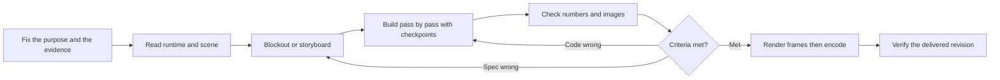

# AI Workflow for Working with Blender

In force since 2026-09-05; updated 2026-09-06 after the audit (`plans/260905-2356-blender-workflow-audit/`): the primary operational file is `AGENTS.md`, success is decided by the `AGENT_OK`/`AGENT_FAIL` sentinel, E1/E2 are implemented, production gate for 3D-printed parts. Keep the two execution/fidelity routers and add the [knowledge workbench](blender-knowledge-workflows.md) to connect the KB, research and the portable concepts that have been scouted. There is no benchmark proving that more skills or a different MCP are needed. This is the process as documented; the helpers that need fixing are recorded separately in the [backlog](blender-workflow-improvement-backlog.md).

## Starting a new session

Read `.project-agent.md`, the BRV manifest and the latest related nodes; then load `blender-agent-core`. State clearly the file/scene being worked on, the single controller, the main output, the acceptance criteria and the unresolved requirements. Do not take the GUI state from an old checkpoint as the current state.



### Eight-step pipeline and output artifacts

```text
Contract → current brief, invariant requirements, assumptions and falsifiable criteria.
Preflight → runtime/scene/units/dependencies/owner and the result of a read-only connection check.
Blockout or storyboard → reference comparison image or short animatic checking exactly what is easiest to disagree about.
Build → scene graph, per-pass script, checkpoints and postconditions; one writer per instance.
Verify → numeric report tied to the revision, images/clips actually viewed, verdict continue/refine-spec/refine-code/request-input/stop.
Render → measured profile, invariant inputs, raw frame sequence and logs with the ranges kept separate.
Deliver → MP4/export that has been decoded/re-imported, review of the correct revision, evidence status kept separate per domain.
Retro → sourced incidents, recipe or backlog in the right place; do not turn every event into a new law.
```

## Required capability set

| Capability | Where it is used in a later session | What must be proven |
|---|---|---|
| Control and checking | [blender-agent-core](../.agents/skills/blender-agent-core/SKILL.md), [hard rules](../.agents/skills/blender-agent-core/references/hard-rules.md) | Correct scene, units, API, writer and success signal; a timeout does not mean a rollback |
| Building from a reference | [blender-image-to-3d](../.agents/skills/blender-image-to-3d/SKILL.md) + KB modeling/materials | Silhouette, proportions and multi-angle shape; do not promise accuracy for what the images do not show |
| Joints, manipulation and animation | [Recipe articulated task](../.agents/skills/blender-agent-core/references/recipes.md#articulated-task) + KB animation/robotics | Correct pivot/hierarchy; real motion; continuous grasp/release; readable story and range of motion |
| 3D printing / dimensional correctness / standards compliance | [Recipe production contract](../.agents/skills/blender-agent-core/references/recipes.md#production-contract) + `specs/README.md` + `scripts/production-gate.py` | `spec.json` before detailing; gate exit 0 with a report carrying the scene+spec hashes; state `exclusions` explicitly (load, real fit, thermal) |
| Mechanics and manufacturing | [Recipe mechanical evidence](../.agents/skills/blender-agent-core/references/recipes.md#mechanical-evidence) + KB precision/printing | Fits, materials, mass/load/duty and the corresponding tests; a watertight mesh does not prove load capacity |
| Render and artifact delivery | [Recipe render delivery](../.agents/skills/blender-agent-core/references/recipes.md#render-delivery) + KB render/export | A profile that suits the scene; keep the raw frames; encode/decode or export/re-import; review the correct revision |

The domain rows are **specialised recipes**, not newly installed skills. In-depth APIs stay in the [Knowledge INDEX](../knowledge/INDEX.md), following the current domain catalogue. The knowledge workbench handles a measured retrieval gap: the old index did not route the research collections and the grimoire. It picks the reading pack; it does not replace execution or create a dedicated skill for the recipes above.

## How to operate with less rework

**Live for adjusting, headless for batch.** Use MCP when it is available and the connection works; the socket client is an existing fallback route, not a reason to create another daemon. Read the state before running a pass. Split off a headless process for fault-test/render; do not let two agents edit one GUI. Ownership is currently a manual convention, with no enforced lock.

**Ask early about the parameters that change the architecture.** For a robot: payload, reach, hold time, actuator/drawing and permission to increase the size. For video: what the viewer needs to see through the action. Lighting choices or previews can be done up front so the user can look at them; do not add a routine approval round.

**Prove the right kind of thing.** Images available → compare silhouettes before detail. Joints present → check frame/pivot/hierarchy before motion polish. Object grasping present → test the hand and the object immediately, do not wait for a full-film render. A story present → watch the animatic, do not only check per-joint angles. A still image does not prove motion pacing, a numeric test does not prove visual perception.

**Handle requirement changes according to their blast radius.** Subtitle change → re-process/re-encode. Script change → redo the trajectory and check the dependencies. Cutting more geometry → re-flag the topology, collision, mass and load evidence that has to be re-checked. Do not lower the 250 g requirement when switching to video work.

**Save render cost with data.** Do not assume by default that Metal is always faster, that 128 samples are always needed or that 6 samples are always enough. Use an existing profile if it meets the requirement. If optimisation is needed, try a baseline and one variant on the same frame/resolution, repeat the measurement, look at the motion quality, and only then choose. The limits of the experiment must be written down beforehand; no general speed-up figure has been proven.

## Separate status per kind of evidence

| Field | Example per artifact/revision | Must not be inferred |
|---|---|---|
| Media | 720-frame/30-second video decodes successfully; some frames viewed | That all temporal quality has been fully viewed by an independent reviewer |
| Motion | Joints and payload run the checked trajectory correctly | That the servo control program or the friction forces are correct |
| Surface screen | The sampled poses pass the surface-intersection check with exclusions | Continuous clearance, solid containment, or that every pose is safe |
| Fit prototype | The original STL revision has geometry/export checks | That this STL represents the geometry revision with the further cuts |
| Manufacture | **BLOCKED** for the goal of holding 250 g for several minutes | That a good-looking video or passing topology has settled load/thermal/adapter |

Every report needs source identity, checker/config, frame range, exclusions, result and timestamp; if something is missing, record it as missing. The hash-tagging procedure is a new requirement at the documentation level; no single common checker enforces it fully yet. The [backlog](blender-workflow-improvement-backlog.md) states the gaps explicitly.

## Assembly, wiring and knowledge updates after Arm

Assembly is its own class of motion: the [recipe](../.agents/skills/blender-agent-core/references/assembly-sequences.md) requires checking the waiting state, the insertion path and the final contact, instead of only checking the completed pose. Assemble from the inside outwards following the dependencies; keep the receiver in frame and the camera still while mating. A repeated failure at the shoulder/elbow must be checked at the same mechanism layer.

A new source goes through scan → read/code review → counter-check scenarios → hash-tagged topic/caution → prepare/review/publish → forward route. A self-test recording PASS does not prove that the parameters actually produce geometry, and does not prove units or fit. The RES-CAD-ROB-13 sources and the wiring/collision boilerplate were checked separately; the figures 120mm, 0.20mm³ and the pinout example must not be promoted by themselves into a general standard. The [full-session summary](../plans/260905-2337-arm-session-retro/plan.md) links the journal, the evidence and the pipeline results.

## Evidence and scope of the summary

[Cost-measuring retro](../plans/reports/retro-260905-1946-blender-workflow.md), [five-perspective debate](../plans/blender-workflow-retro/debate.md), [research and sources](../plans/blender-workflow-retro/research.md), [fault probes](../plans/blender-workflow-retro/reports/runtime-contract-probes.json). The conclusion about the chosen way of packaging this is a recommendation that has been challenged; its effectiveness on the next project still has to be measured.

One lesson kept: **every claim must come with an artifact and a check that can genuinely falsify it**.
