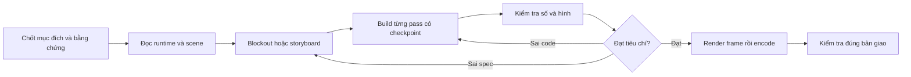

# Workflow AI làm việc với Blender

Áp dụng từ 2026-09-05; cập nhật 2026-09-06 sau audit (`plans/260905-2356-blender-workflow-audit/`): file vận hành chính là `AGENTS.md`, thành công quyết định bằng sentinel `AGENT_OK`/`AGENT_FAIL`, E1/E2 đã implement, gate production cho part in 3D. Giữ hai router execution/fidelity và bổ sung [knowledge workbench](blender-knowledge-workflows.md) để nối KB, research và portable concepts đã được scout. Không có benchmark chứng minh cần thêm nhiều skill hoặc thay MCP. Đây là quy trình đã đưa vào tài liệu; các helper cần sửa được ghi riêng trong [backlog](blender-workflow-improvement-backlog.md).

## Bắt đầu phiên mới

Đọc `.project-agent.md`, BRV manifest và node liên quan mới nhất; sau đó nạp `blender-agent-core`. Ghi rõ file/scene đang làm, controller duy nhất, đầu ra chính, tiêu chí đạt và yêu cầu chưa giải quyết. Không lấy trạng thái GUI trong checkpoint cũ làm trạng thái hiện tại.



### Pipeline tám bước và artifact đầu ra

```text
Contract → brief hiện hành, yêu cầu bất biến, giả định và tiêu chí có thể bác bỏ.
Preflight → runtime/scene/units/dependencies/owner và kết quả kiểm tra kết nối đọc-only.
Blockout hoặc storyboard → ảnh so reference hoặc animatic ngắn kiểm tra đúng điều dễ bất đồng.
Build → scene graph, script từng pass, checkpoint và postconditions; một writer cho mỗi instance.
Verify → report số gắn revision, ảnh/clip đã xem, verdict continue/refine-spec/refine-code/request-input/stop.
Render → profile đã kiểm tra, input bất biến, raw frame sequence và log các range tách biệt.
Deliver → MP4/export đã decode/re-import, review đúng bản, trạng thái bằng chứng riêng từng lĩnh vực.
Retro → incident có nguồn, recipe hoặc backlog đúng nơi; không biến mọi sự kiện thành luật mới.
```

## Bộ năng lực cần có

| Năng lực | Nơi dùng trong phiên sau | Điều phải chứng minh |
|---|---|---|
| Điều khiển và kiểm tra | [blender-agent-core](../.agents/skills/blender-agent-core/SKILL.md), [hard rules](../.agents/skills/blender-agent-core/references/hard-rules.md) | Đúng scene, đơn vị, API, writer và tín hiệu thành công; timeout không đồng nghĩa rollback |
| Dựng theo reference | [blender-image-to-3d](../.agents/skills/blender-image-to-3d/SKILL.md) + KB modeling/materials | Silhouette, tỷ lệ và hình đa góc; không hứa chính xác phần ảnh không thể hiện |
| Khớp, thao tác và animation | [Recipe articulated task](../.agents/skills/blender-agent-core/references/recipes.md#articulated-task) + KB animation/robotics | Pivot/hierarchy đúng; chuyển động thật; grasp/release liên tục; câu chuyện và phạm vi động tác đọc được |
| In 3D / đúng kích thước / đúng chuẩn | [Recipe production contract](../.agents/skills/blender-agent-core/references/recipes.md#production-contract) + `specs/README.md` + `scripts/production-gate.py` | `spec.json` trước khi detail; gate exit 0 với report gắn hash scene+spec; ghi rõ `exclusions` (tải, fit thật, nhiệt) |
| Cơ khí và chế tạo | [Recipe mechanical evidence](../.agents/skills/blender-agent-core/references/recipes.md#mechanical-evidence) + KB precision/printing | Fits, vật liệu, khối lượng/tải/duty và các phép thử tương ứng; mesh kín không chứng minh chịu lực |
| Render và giao artifact | [Recipe render delivery](../.agents/skills/blender-agent-core/references/recipes.md#render-delivery) + KB render/export | Profile phù hợp scene; giữ raw frames; encode/decode hoặc export/re-import; review đúng revision |

Các hàng domain là **recipe chuyên biệt**, chưa phải skill mới được cài. API chuyên sâu tiếp tục ở [Knowledge INDEX](../knowledge/INDEX.md), theo danh mục domain hiện hành. Knowledge workbench xử lý khoảng trống retrieval đã đo: index cũ không route các research collections và grimoire. Nó chọn reading pack, không thay execution hoặc tạo skill riêng cho các recipe trên.

## Cách vận hành ít phải làm lại

**Live để chỉnh, headless để batch.** Dùng MCP khi có và kết nối hoạt động; socket client là đường dự phòng đã có, không phải lý do tạo thêm daemon. Đọc trạng thái trước khi chạy pass. Tách process headless để fault-test/render; không để hai agent sửa một GUI. Quyền sở hữu hiện là quy ước thủ công, chưa có lock cưỡng chế.

**Hỏi sớm những thông số đổi kiến trúc.** Với robot: payload, reach, thời gian giữ, actuator/drawing và cho phép tăng kích thước. Với video: người xem cần thấy điều gì qua hành động. Các lựa chọn ánh sáng hoặc preview có thể làm trước để người dùng nhìn được; không thêm vòng xin duyệt thường lệ.

**Chứng minh đúng loại việc.** Có ảnh → so silhouette trước chi tiết. Có khớp → kiểm tra frame/pivot/hierarchy trước motion polish. Có cầm vật → thử hand và vật ngay, không đợi render toàn phim. Có câu chuyện → xem animatic, không chỉ kiểm tra góc từng khớp. Ảnh tĩnh không chứng minh nhịp chuyển động, phép thử số không chứng minh cảm nhận thị giác.

**Đổi yêu cầu theo phạm vi ảnh hưởng.** Đổi phụ đề → xử lý/encode lại. Đổi kịch bản → làm lại trajectory và kiểm tra phụ thuộc. Cắt thêm geometry → đánh dấu lại bằng chứng topology, collision, khối lượng và tải cần kiểm tra. Không hạ yêu cầu 250 g khi chuyển sang làm video.

**Tiết kiệm render bằng dữ liệu.** Không mặc định Metal luôn nhanh hơn, 128 samples luôn cần hoặc 6 samples luôn đủ. Dùng profile đã có nếu đạt yêu cầu. Nếu cần tối ưu, thử baseline và một biến thể trên cùng frame/resolution, lặp đo, xem chất lượng chuyển động rồi mới chọn. Giới hạn thử phải được ghi trước; chưa có con số tăng tốc tổng quát được chứng minh.

## Trạng thái riêng cho từng loại bằng chứng

| Trường | Ví dụ theo artifact/revision | Không được suy ra |
|---|---|---|
| Media | Video 720 frame/30 giây decode đạt; một số frame đã xem | Tất cả chất lượng thời gian đã được người review độc lập xem hết |
| Motion | Khớp và payload chạy đúng trajectory được kiểm tra | Chương trình điều khiển servo hoặc lực ma sát đúng |
| Surface screen | Các pose được lấy mẫu đạt kiểm tra giao bề mặt có exclusions | Clearance liên tục, solid containment hoặc mọi tư thế đều an toàn |
| Fit prototype | STL revision gốc có kiểm tra geometry/export | STL đó đại diện geometry revision đã cắt thêm |
| Manufacture | **BLOCKED** với mục tiêu 250 g giữ nhiều phút | Video đẹp hoặc topology đạt đã giải quyết tải/nhiệt/adapter |

Mỗi report cần source identity, checker/config, frame range, exclusions, kết quả và thời điểm; nếu thiếu thì ghi thiếu. Quy trình gắn hash là yêu cầu mới ở mức tài liệu, chưa có một checker chung thực thi đầy đủ. [Backlog](blender-workflow-improvement-backlog.md) ghi rõ các lỗ hổng.

## Assembly, dây và cập nhật kiến thức sau Arm

Assembly là một loại chuyển động riêng: [recipe](../.agents/skills/blender-agent-core/references/assembly-sequences.md) yêu cầu kiểm trạng thái chờ, đường đưa vào và tiếp xúc cuối, thay vì chỉ kiểm pose hoàn chỉnh. Lắp từ trong ra ngoài theo phụ thuộc; giữ receiver trong hình và camera yên khi đang ghép. Lỗi lặp ở vai/khuỷu phải kiểm cùng lớp cơ cấu.

Nguồn mới đi qua scan → đọc/code review → tình huống đối chứng → topic/caution gắn hash → prepare/review/publish → forward route. Self-test ghi PASS không chứng minh các tham số thật sự tạo geometry, không chứng minh đơn vị hay fit. Các nguồn RES-CAD-ROB-13 và boilerplate wiring/collision đã được kiểm riêng; số 120mm, 0.20mm³ và ví dụ pinout không được tự nâng thành chuẩn chung. [Tổng kết toàn phiên](../plans/260905-2337-arm-session-retro/plan.md) nối journal, bằng chứng và kết quả pipeline.

## Bằng chứng và phạm vi tổng kết

[Retro đo chi phí](../plans/reports/retro-260905-1946-blender-workflow.md), [debate năm góc nhìn](../plans/blender-workflow-retro/debate.md), [research và nguồn](../plans/blender-workflow-retro/research.md), [fault probes](../plans/blender-workflow-retro/reports/runtime-contract-probes.json). Kết luận chọn cách đóng gói là khuyến nghị đã phản biện; hiệu quả trên dự án tiếp theo còn cần đo.

Một bài học giữ lại: **mỗi tuyên bố phải đi cùng artifact và phép kiểm tra thực sự có thể bác bỏ nó**.
