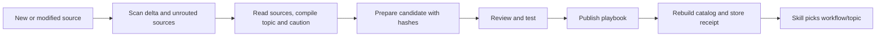

# Using Blender Knowledge in Real Work

Entry point: [blender-knowledge-workbench](../.agents/skills/blender-knowledge-workbench/SKILL.md). The tool uses the Python standard library, installs no dependency and does not open or modify Blender.

```bash
python3 scripts/blender-knowledge.py check
python3 scripts/blender-knowledge.py list
python3 scripts/blender-knowledge.py route native-animation-rigging
python3 scripts/blender-knowledge.py search "heat-set inserts" --limit 5
python3 scripts/blender-knowledge.py show knowledge/70-cad-precision-robotics/robotics-urdf-mechanisms.md --start 60 --lines 80
```

Run it at the Blender root or use an absolute path to the script. The CLI outputs JSON for the AI to read directly. `show` only reads paths present in the catalog; it does not execute code. Search strips diacritics, works on keywords, and does not translate or infer semantics. Workflow IDs and English technical terms make the selection more accurate.

## Workflows by output

The current list and reading packs are owned by [catalog-config.json](../knowledge/catalog-config.json); `list` and `route` are the executable source — do not copy the whole configuration into a skill.

| Kind of work | Workflow |
|---|---|
| Building from images, shape/material polish | `native-hard-surface`, `native-product-visualization` |
| Joints, hand, manipulation, explode; procedural/simulation | `native-animation-rigging`, `native-procedural-simulation` |
| Plastic printing, assembly/disassembly, datum/tolerance | `polymer-functional-print`, `precision-assembly-metrology` |
| Transmission/load and robot links/URDF | `mechanisms-transmissions`, `robotics-links-simulation` |
| Video render or export | `render-export-delivery` |

Each pack returns: purpose → required → supplemental/concepts/adapters → steps → gates → limitations. Required is at most 8 documents, including the 3 foundations. Only reload documents not already in context. `loads_with` contains link cycles; the catalog validates the targets and keeps all the edges, but does not expand recursively. Related is only one extra reading hop.

Arm example: use `native-animation-rigging` as the primary to build a natural task and show the range of motion; add gates from `mechanisms-transmissions` and `polymer-functional-print` for manufacturing, and `render-export-delivery` for the film. Do not load every document of the four packs. A video without subtitles is a requirement of the current task, not a rule for every video. The status of holding 250 g for several minutes stays BLOCKED until there is corresponding mechanical evidence.

## Sources and confidence level

The catalog scans Markdown in `knowledge/`, `research/` (excluding tools), `docs/`, `.agents/skills/` by itself; JSONL dictionary data inside skills; source scripts, Python in `scripts/boilerplates/` and Python tests. Build examples are an explicitly chosen list in the config. `.claude/skills/` is a hashed mirror and does not create duplicate hits. It does not index `.git`, caches, virtual environments, binaries, media or the whole of the old output. There is no claim that every byte in the folders has been indexed.

The [auto-generated catalog](../knowledge/catalog.json) records source path/SHA256, title/heading/line, dependencies, use class, mirror and the static-audit notes. The four img2threejs JSONL files are indexed as four text sources; the record count inside them is not the catalog's document count.

Only six selected grimoire concepts are routed from img2threejs: image analysis, surface, detail inventory, joint attachment, shading review and self-correction. The rest can be found with `--scope all` for historical research. Do not import Three.js/CS2 mechanisms, asset retrieval or vendor fallback into Blender. The original package version and the typo mirror are kept as they are, with a warning.

Eight root research articles about the generation/acquisition pipeline are kept as `archive-only`, including the two that mix theory/cleanup with service proposals. Engineering research with a bibliography is still synthesis. Snippets where the naming and the code diverge get a caution tagged by hash in the config. When using a parameter/standard/API, check the provenance and the appropriate version. The notes in the catalog do not replace a full mechanical qualification.

## From reading documents to running Blender

`blender-knowledge-workbench` selects the evidence; `blender-agent-core` owns execution/verify; `blender-image-to-3d` owns fidelity. Keep these three responsibilities; do not create a separate skill for each domain.

Before using an adapter, read the annotation together with the source file: runtime, scene/names/input, unit/scale, where the output is written and the actual predicate. A pass script may expect the scene its predecessor built; the arm examples have fixed output paths; a numeric check may write a report or modify the mesh. Create a separate candidate, declare the output and the checkpoint. Apply the [execution recipe](../.agents/skills/blender-agent-core/references/recipes.md#explicit-execution-context); do not run historical commands directly into the current GUI.

Keep the loop Spec → Plan → Code → Critic → Execute → Verify → Refine. Pick the cheapest measurement that answers the question, then look at images/motion for what only the eye can judge. The catalog does not fix the old helpers: [E1–E7](blender-workflow-improvement-backlog.md) is still backlog.

## Maintenance and verification

```bash
python3 scripts/blender-knowledge.py build
python3 scripts/blender-knowledge.py check
python3 -m unittest discover -s tests/knowledge -v
```

`build` scans and hashes twice, rejects a snapshot that changes while being read, and writes atomically. `check`, `list`, `route`, `search`, `show` all re-check against the sources: changing/adding/deleting a source or the config makes the catalog stale; a missing dependency and a diverging owned mirror are errors. After the source writer finishes, rebuild the catalog; if the workflow playbook is out of date, use the prepare/review/publish pipeline to recompile it. A catalog build on its own does not make an old playbook valid. An external process cannot be locked out by hash checking alone; before execution the selected source revision must be kept unchanged.

Change workflows/cautions in the config; the source technical docs are updated by their owner. The annotation includes the hash at review time; a new hash does not by itself prove the old problem has been fixed. Sync the three project-owned skills to `.claude/skills/`; do not modify/copy `.git` or force a sync of the img2threejs package. Build the catalog after the final edit. Validating corpus/schema/mirror does not certify content or working speed; real effectiveness has to be measured on the next build.

## Pipeline for updating knowledge → workflow → skill

The [compilation procedure](../.agents/skills/blender-knowledge-workbench/references/knowledge-to-workflow.md) owns the steps and the commands. There is no need to create a separate skill for each research article. Pick the topic by task, keep the hash-tagged source review and generate the [workflow playbook](../knowledge/generated-workflows.md) for skills to read selectively.



```bash
python3 scripts/knowledge-pipeline.py scan
python3 scripts/knowledge-pipeline.py prepare --bundle plans/knowledge-updates/candidate.json
python3 scripts/blender-knowledge.py route native-product-visualization --topic thin-film-optics
```

`prepare` requires the config to be compiled first; publish uses the digest of the reviewed candidate. This is a pipeline with an assessment step by the AI/the compiler, not knowledge self-certification. The optional topics live inside the 9 workflows; `list`/`route` is the current list. A deferral with reason+hash keeps a document outside the workflows without removing it from search. A change to a source or the config invalidates a candidate; changing a topic's source makes that topic's route require a new review.
