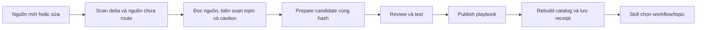

# Dùng kiến thức Blender trong công việc thực tế

Điểm vào: [blender-knowledge-workbench](../.agents/skills/blender-knowledge-workbench/SKILL.md). Công cụ dùng Python standard library, không cài dependency và không mở/sửa Blender.

```bash
python3 scripts/blender-knowledge.py check
python3 scripts/blender-knowledge.py list
python3 scripts/blender-knowledge.py route native-animation-rigging
python3 scripts/blender-knowledge.py search "heat-set inserts" --limit 5
python3 scripts/blender-knowledge.py show knowledge/70-cad-precision-robotics/robotics-urdf-mechanisms.md --start 60 --lines 80
```

Chạy ở root Blender hoặc dùng đường dẫn tuyệt đối tới script. CLI xuất JSON để AI đọc trực tiếp. `show` chỉ đọc path có trong catalog; không thực thi code. Search bỏ dấu, dùng từ khóa, không dịch hoặc suy luận ngữ nghĩa. ID workflow và các thuật ngữ kỹ thuật tiếng Anh giúp chọn chính xác hơn.

## Workflow theo đầu ra

Danh sách và reading pack hiện hành do [catalog-config.json](../knowledge/catalog-config.json) sở hữu; `list` và `route` là nguồn thực thi, không sao chép toàn bộ cấu hình sang skill.

| Loại việc | Workflow |
|---|---|
| Dựng theo ảnh, polish hình/vật liệu | `native-hard-surface`, `native-product-visualization` |
| Khớp, hand, thao tác, explode; procedural/simulation | `native-animation-rigging`, `native-procedural-simulation` |
| In nhựa, tháo lắp, datum/dung sai | `polymer-functional-print`, `precision-assembly-metrology` |
| Truyền động/tải và robot links/URDF | `mechanisms-transmissions`, `robotics-links-simulation` |
| Render video hoặc export | `render-export-delivery` |

Mỗi pack trả: purpose → required → supplemental/concepts/adapters → steps → gates → limitations. Required tối đa 8 tài liệu, gồm 3 nền. Chỉ nạp lại tài liệu chưa có trong context. `loads_with` có vòng liên kết; catalog kiểm tra target, giữ đủ cạnh, nhưng không mở rộng đệ quy. Related chỉ là một hop đọc thêm.

Ví dụ arm: dùng `native-animation-rigging` làm primary để dựng task tự nhiên và show biên độ; bổ sung gate từ `mechanisms-transmissions` và `polymer-functional-print` cho chế tạo, `render-export-delivery` cho phim. Không nạp tất cả tài liệu của bốn pack. Video không phụ đề là yêu cầu của task hiện tại, không là quy tắc cho mọi video. Trạng thái chịu 250 g nhiều phút vẫn BLOCKED cho đến khi có bằng chứng cơ khí tương ứng.

## Nguồn và mức tin cậy

Catalog tự quét Markdown trong `knowledge/`, `research/` (trừ tools), `docs/`, `.agents/skills/`; dữ liệu từ điển JSONL trong skills; script gốc, Python trong `scripts/boilerplates/` và Python tests. Build examples là danh sách chọn rõ trong config. `.claude/skills/` là mirror có hash, không tạo hit trùng. Không index `.git`, cache, môi trường ảo, binaries, media hoặc toàn bộ output cũ. Không có tuyên bố đã index mọi byte trong folder.

[Catalog sinh tự động](../knowledge/catalog.json) ghi source path/SHA256, title/heading/line, dependencies, use class, mirror và các lưu ý static audit. Bốn file JSONL img2threejs được index như bốn nguồn văn bản; số record bên trong không phải số tài liệu của catalog.

Chỉ sáu grimoire concepts đã chọn được route từ img2threejs: phân tích ảnh, surface, detail inventory, joint attachment, shading review và self-correction. Phần còn lại có thể tìm ở `--scope all` để nghiên cứu lịch sử. Không import cơ chế Three.js/CS2, asset retrieval hay vendor fallback vào Blender. Bản package gốc và typo mirror được giữ nguyên có cảnh báo.

Tám bài root research về generation/acquisition pipeline được giữ ở `archive-only`, kể cả hai bài trộn lý thuyết/cleanup với đề xuất dịch vụ. Research engineering có bibliography vẫn là synthesis. Các snippet có sai lệch giữa tên gọi và code được gắn caution theo hash trong config. Khi dùng thông số/chuẩn/API, kiểm tra nguồn gốc và phiên bản phù hợp. Những lưu ý trong catalog không thay cho một cuộc kiểm định cơ khí đầy đủ.

## Từ đọc tài liệu đến chạy Blender

`blender-knowledge-workbench` chọn bằng chứng; `blender-agent-core` sở hữu execution/verify; `blender-image-to-3d` sở hữu fidelity. Giữ ba trách nhiệm này, không tạo một skill riêng cho từng lĩnh vực.

Trước khi dùng adapter, đọc annotation cùng file nguồn: runtime, scene/names/input, unit/scale, nơi ghi output và predicate thực sự. Ví dụ drone có thể xóa toàn scene; arm examples có fixed paths; numeric check có thể ghi report hoặc sửa mesh. Tạo candidate riêng, khai báo output và checkpoint. Áp dụng [execution recipe](../.agents/skills/blender-agent-core/references/recipes.md#explicit-execution-context); không chạy lệnh lịch sử trực tiếp vào GUI hiện tại.

Giữ vòng Spec → Plan → Code → Critic → Execute → Verify → Refine. Chọn phép đo rẻ nhất trả lời được câu hỏi, rồi xem hình/chuyển động cho những điều mắt mới đánh giá được. Catalog không sửa các helper cũ: [E1–E7](blender-workflow-improvement-backlog.md) vẫn là backlog.

## Bảo trì và kiểm chứng

```bash
python3 scripts/blender-knowledge.py build
python3 scripts/blender-knowledge.py check
python3 -m unittest discover -s tests/knowledge -v
```

`build` quét và hash hai lần, từ chối snapshot thay đổi trong lúc đọc, ghi atomically. `check`, `list`, `route`, `search`, `show` đều đối chiếu lại nguồn: thay đổi/thêm/xóa source hoặc config làm catalog stale; dependency thiếu và owned mirror lệch là lỗi. Sau khi source writer hoàn tất, build lại catalog; nếu workflow playbook đã cũ, dùng pipeline prepare/review/publish để biên dịch lại. Catalog build đơn lẻ không làm playbook cũ trở thành hợp lệ. Không thể khóa một tiến trình bên ngoài chỉ bằng kiểm tra hash; trước execution phải giữ nguyên source revision đã chọn.

Đổi workflow/caution trong config; source technical docs do người sở hữu cập nhật. Annotation gồm hash lần review; hash mới không tự chứng minh vấn đề cũ đã được sửa. Đồng bộ ba skill project-owned sang `.claude/skills/`; không sửa/copy `.git` hoặc ép sync package img2threejs. Build catalog sau edit cuối cùng. Kiểm định corpus/schema/mirror không chứng nhận nội dung hoặc tốc độ làm việc; hiệu quả thực tế cần đo ở build tiếp theo.

## Pipeline cập nhật knowledge → workflow → skill

[Quy trình biên soạn](../.agents/skills/blender-knowledge-workbench/references/knowledge-to-workflow.md) sở hữu các bước và lệnh. Không cần tạo skill riêng cho từng bài research. Chọn topic theo task, giữ source review gắn hash và sinh [workflow playbook](../knowledge/generated-workflows.md) để skill đọc có chọn lọc.



```bash
python3 scripts/knowledge-pipeline.py scan
python3 scripts/knowledge-pipeline.py prepare --bundle plans/knowledge-updates/candidate.json
python3 scripts/blender-knowledge.py route native-product-visualization --topic thin-film-optics
```

`prepare` cần biên soạn config trước; publish dùng digest candidate đã review. Đây là pipeline có bước đánh giá của AI/người biên soạn, không phải tự chứng nhận kiến thức. Các topic tùy chọn nằm trong 9 workflow; `list`/`route` là danh sách hiện hành. Deferral có lý do+hash giữ tài liệu ngoài workflow mà không xóa khỏi search. Nguồn hoặc config thay đổi làm candidate hết hiệu lực; thay đổi nguồn topic làm route của topic yêu cầu review lại.
