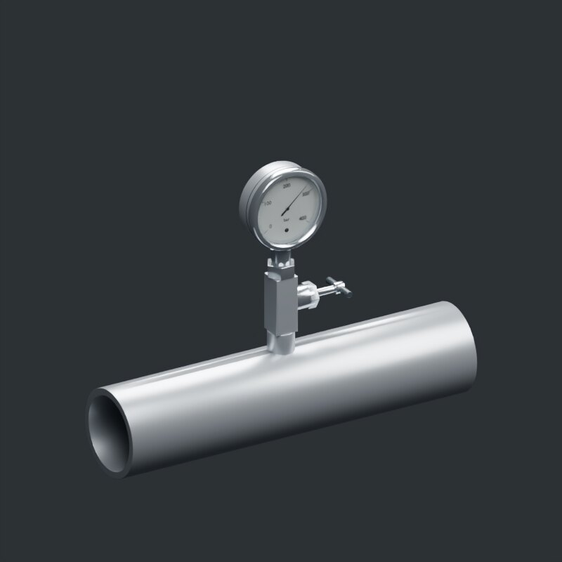
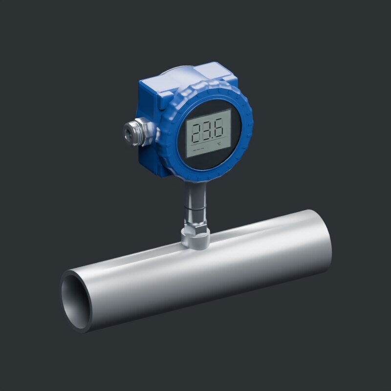

# Reusable instrumentation

[All galleries](../../README.md#image-galleries) · [Source and output provenance](../media/gallery/manifest.json)

Render-only illustrative reuse study; no vendor, process-interface, or manufacturing claim.

Images contain no added labels or captions. Product markings already present in the native model are retained.

## Pressure instrument mount

## Temperature instrument mount

These are presentation derivatives. The manifest distinguishes HQ source media from verification previews; none of these images establishes physical or manufacturing qualification.
