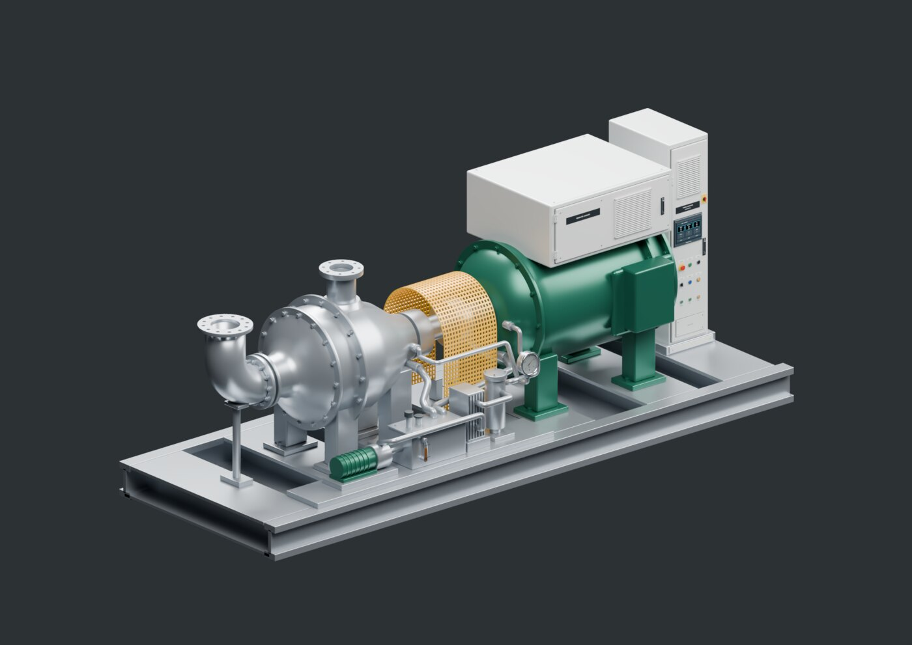
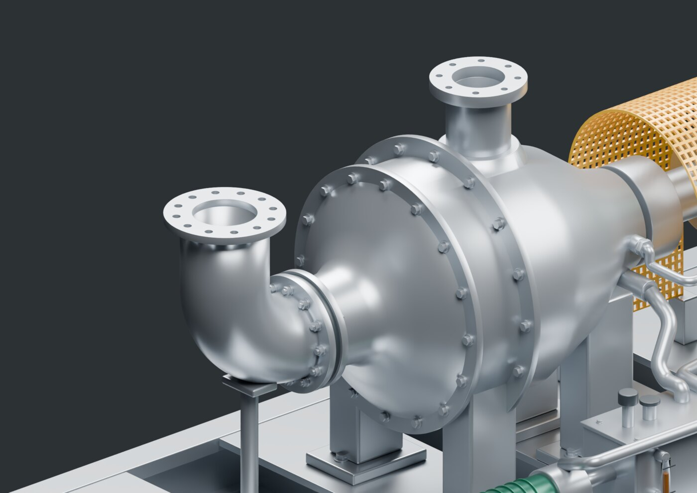
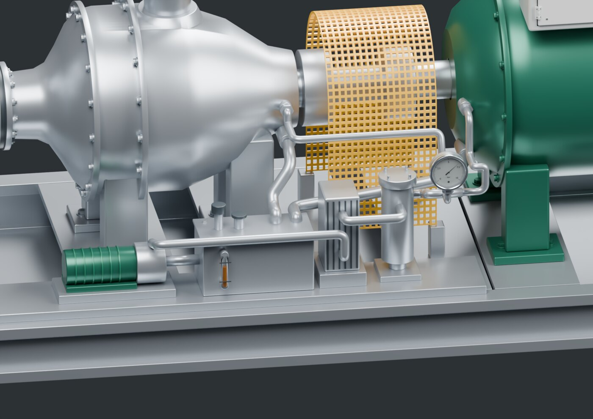
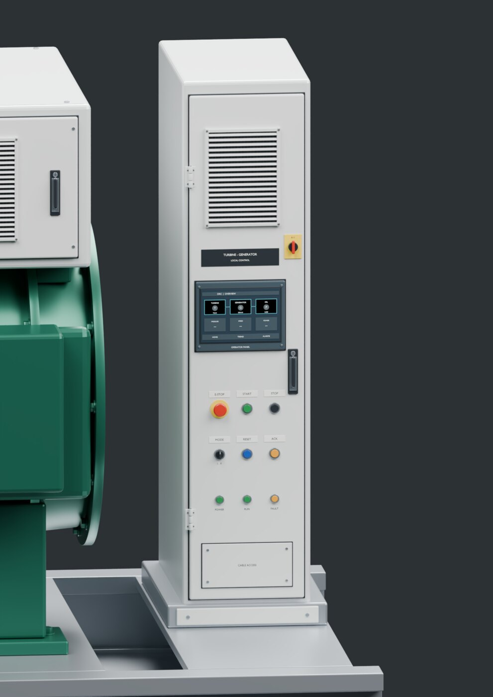
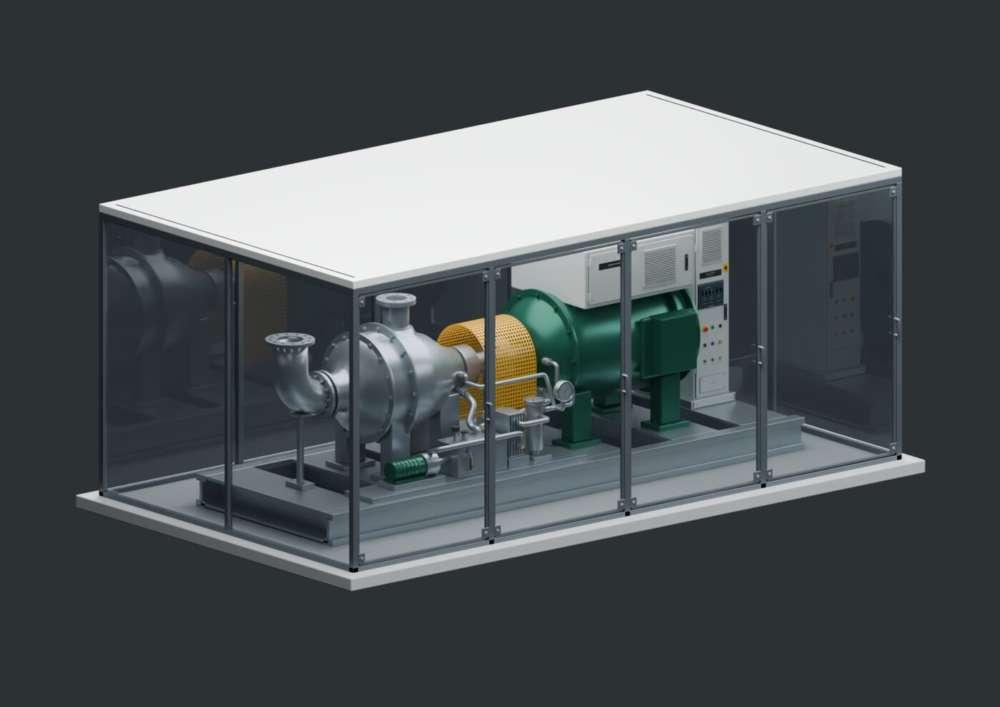
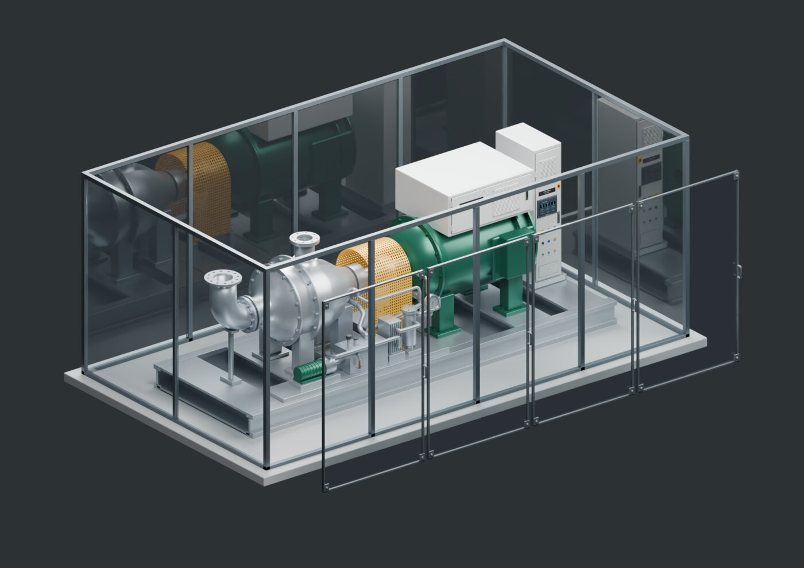
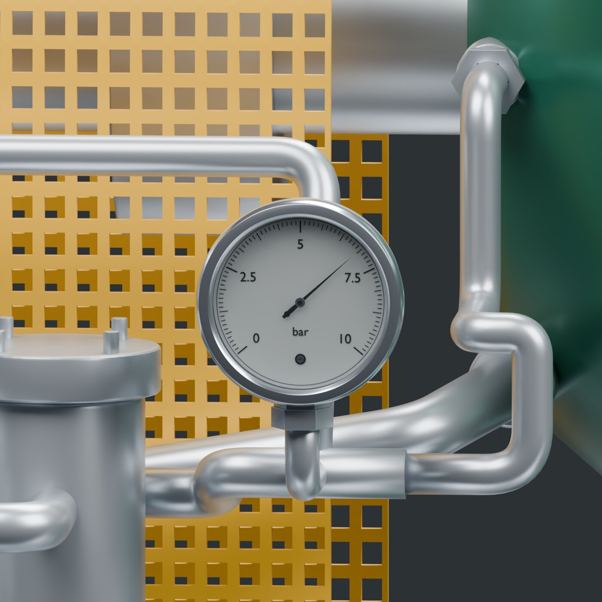
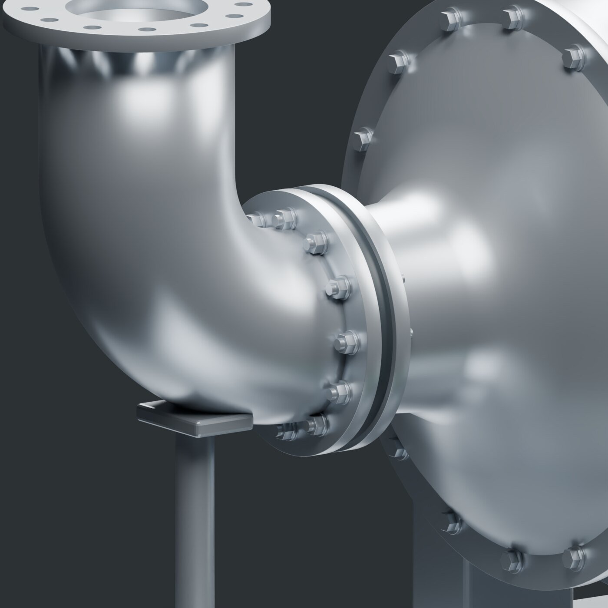

# Turbine generator

[All galleries](../../README.md#image-galleries) · [Source and output provenance](../media/gallery/manifest.json)

HQ review media complete after cabinet correction; render-only evidence.

Images contain no added labels or captions. Product markings already present in the native model are retained.

## Turbine generator overview

## Turbine process flanges

## Turbine oil console

## Turbine control cabinet

## Turbine glazed hall

## Turbine panel removed

## Turbine pressure gauge

## Turbine exhaust joint

These are presentation derivatives. The manifest distinguishes HQ source media from verification previews; none of these images establishes physical or manufacturing qualification.
