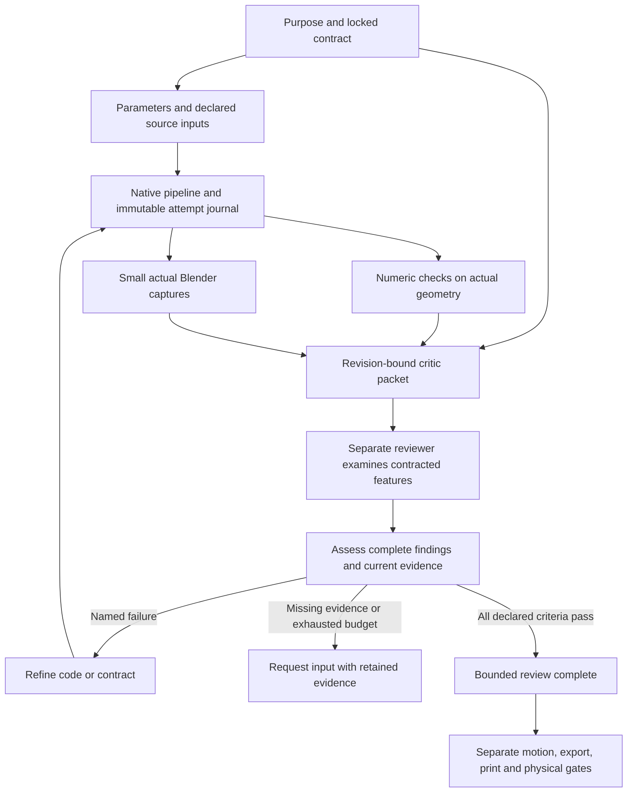

# Native integration of Meshy, Dream-loop and Text-to-CAD patterns

The implementation keeps source identity, execution state and acceptance evidence
separate. A completed process produces a revision to inspect; it does not approve
the model. Everything here runs locally through existing Blender and Python routes.

## Source map

| Upstream revision | Mechanism retained | Local implementation |
|---|---|---|
| Meshy `b9db44b5663e6e92d89828bf2e4fe1dc1b3f6610` | Composable task runner, task lineage, bounded references and generated-copy freshness | `scripts/native-pipeline.py`, `scripts/native_pipeline/`, existing skill/catalog publication |
| Dream-loop `9bddb901f7d071cfefdd21e264267c757177a9df` | Locked visual destination, separate critic, actionable feedback, stall recovery; durable uncertain-job semantics | `scripts/native-review.py`, `scripts/native_review/`, target-bound review recipe |
| Text-to-CAD `366937e382978036925d86c3659876b1e98852a2` | Explicit units/parameters/frames/datums, declared inputs, source/artifact identity separation | `scripts/boilerplates/bp_parametric_contract.py`, source/export byte receipts |

Detailed pinned-code analyses are [Meshy](../research/upstream-agent-patterns/meshy.md),
[Dream-loop](../research/upstream-agent-patterns/dream-loop.md), and
[Text-to-CAD](../research/upstream-agent-patterns/text-to-cad.md). They distinguish
upstream documentation, executable enforcement, upstream test intent and local
execution. Upstream tests were inspected as source, not executed. Original upstream
notices and licensing discrepancies are recorded; no substantial upstream code was
copied into these independently implemented helpers.

## How the layers work together



The pipeline is a sequential, bounded dependency graph, not a distributed scheduler.
It journals before launch, records immutable attempts and hashes declared inputs and
outputs. It runs `headless-run.sh` with its runtime/factory path enabled. Required
postconditions must contain finite numerical values. `executed` is deliberately an
execution-and-artifact status, never a universal quality or manufacturing status.

`--resume` reuses matching executed work and starts only untouched pending steps.
Running, failed and unknown attempts require inspection; they are never silently
replayed. A deliberately new run directory retains the original evidence during
recovery. Arbitrary Python is not sandboxed by this controller; payload ownership
and the existing project rules still apply.

## Native calibration sample

The sample creates a blue body, a broad base and two collars. Its negative variant
omits one collar while retaining the same overall height. It is a controlled
calibration fixture for the execution/review machinery, not evidence of autonomous
learning, a general reconstruction benchmark or a printable mechanical assembly.

From the repository root, use a new run directory:

```bash
python3 scripts/native-pipeline.py check specs/examples/native-iteration-pipeline.json
python3 scripts/native-pipeline.py run specs/examples/native-iteration-pipeline.json \
  --run-dir output/native-iteration-demo-r01
python3 scripts/native-pipeline.py status --run-dir output/native-iteration-demo-r01
python3 scripts/samples/native-iteration-review.py \
  --run-dir output/native-iteration-demo-r01 --round 1
```

Three disposable Blender processes produce 256 px verification images and separate
native scenes. Output is under `steps/<step>/attempt-0001/`; the reference, negative
candidate and complete revision each retain `model.blend`, `proof.png`, normalized
`contract.json`, measured `numeric.json`, and `summary.json` with source bindings.
The journal retains start/terminal records and process logs. Images are not delivery
media and manufacture is NOT_REQUESTED.

The review script creates a versioned target, an exact packet and an incomplete
critic template under `reviews/`. Ask a separate reviewer to open the target and
candidate PNGs and complete `critique-r01.json` from actual visual evidence. It must
cover every contracted feature, mark uncertainty explicitly and specify a correction
or new check for any failure. Do not replace those observations with code counts.

```bash
python3 scripts/native-review.py assess \
  --packet output/native-iteration-demo-r01/reviews/packet-r01.json \
  --critique output/native-iteration-demo-r01/reviews/critique-r01.json \
  --out output/native-iteration-demo-r01/reviews/assessment-r01.json
```

Exit 1 is expected when the actual reviewer records the missing collar. The model
can have a passing height check and still need visual refinement. To assess the
controlled complete variant with the same target and previous findings:

```bash
python3 scripts/samples/native-iteration-review.py \
  --run-dir output/native-iteration-demo-r01 --round 2
```

Complete that new critique from the new image before assessing it with analogous
`r02` paths. The complete variant was generated as a positive control; its presence
does not demonstrate an agent independently implemented the critic's correction.
For a real task the builder must make and verify that correction in a new candidate.

## Reusing the APIs

Pipeline payloads read `DESIGN_OS_OUTPUT_DIR` and `DESIGN_OS_INPUTS_JSON`. The input
JSON has `project` and `artifacts` maps. To consume another step's output, explicitly
declare `artifact_inputs: ["build:model.blend"]` and `depends_on: ["build"]`. Source
helpers beyond the fixed runtime must be named in `inputs`; no transitive import
discovery is implied. The sample demonstrates a measured dependency summary passed
between isolated steps.

The parameter helper accepts explicit scalar length values in `mm`/`m`, normalizes
to metres and validates a rigid right-handed frame graph. Ports and
visual/collision/physical roles are semantic declarations. It does not compose a
whole frame hierarchy, inspect named Blender objects, solve mating constraints or
qualify collision/inertial data. Its exported-file receipt is a byte/hash record;
the existing isolated export/re-import checks still verify format semantics.

The critic packet checks target/candidate/proof/numeric hashes and complete feature
coverage. It validates a declared camera/frame/projection/context contract, but the
renderer/controller must establish that the actual capture used it. A reviewer
name is declared independence, not authentication. The code does not perform image
recognition or manufacture acceptance. Read the limits in every assessment.

## Skill entry points and research maintenance

```bash
python3 scripts/blender-knowledge.py route native-hard-surface --topic upstream-agent-patterns
python3 scripts/blender-knowledge.py route native-hard-surface --topic target-bound-review
python3 scripts/blender-knowledge.py route render-export-delivery --topic native-task-lifecycle
python3 scripts/blender-knowledge.py route precision-assembly-metrology --topic parametric-source-contract
```

The existing core, image-to-3D and knowledge-workbench skills route this practice.
The full procedure is [native-agent-iteration](../knowledge/60-pipeline/native-agent-iteration.md).
Upstream changes need a new source/claim review before promotion. The existing
prepare/review/publish pipeline binds topic source hashes and checks owned mirrors.

## What this integration does not import

Meshy/Fal hosted generation, paid asset workflows, vendor STEP downloads, build123d /
OpenCascade / CadQuery, broad module-eviction daemons, slicers, G-code/device control
and subscription-based agent routing are excluded. Their useful contracts or
boundaries are described in the source analyses, but those capabilities have not
silently become available in Blender. The native asset policy, production gate,
and physical qualification requirements remain in force.

Execution and review evidence for this work is recorded in
`plans/260917-upstream-agent-integration/reports/`.
